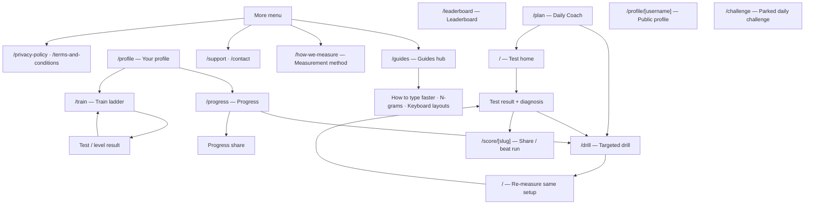

# TypeCafe system map

**Last verified:** 2026-07-12 through the independent progress-column slice

**Purpose:** a compact map of the current system. It records stable ownership and
invariants, then points to code for details. Product history belongs in the
feature/architecture ledgers; settled reasoning belongs in ADRs.

## Product loop

TypeCafe is a typing coach. The critical journey is:

```text
Measure a Test
  -> diagnose its keystroke evidence
  -> open a targeted Drill
  -> re-measure the same configuration
  -> show the Delta
```

Every product review starts with [the vision](../vision.md). Canonical domain
language lives in [`CONTEXT.md`](../../CONTEXT.md).

## User-facing site map

This is the current information architecture, including the navigation shell and
the improvement loop between testing, diagnosis, drilling, and proof. API routes,
OAuth callbacks, and the XML sitemap endpoint are service surfaces rather than
user-facing destinations.



Navigation ownership:

- Primary rail/bottom navigation: Home, Progress, Train, Daily Coach, Leaderboard,
  and signed-in Profile.
- The More menu: Guides, Support, Contact, Privacy, Terms, and How we measure.
- Public/deep-link surfaces: shared scores, public profiles, guide articles, and
  the parked Challenge route.
- The shortest improvement path remains `Home → Score/diagnosis → Drill → Home`;
  Progress and Daily Coach are supporting entry points into the same drill loop.

## Runtime shape

| Concern | Current owner |
|---|---|
| Web runtime | Next.js Pages Router (`src/pages/`) |
| App providers | `src/pages/_app.tsx` |
| Global shell | `src/components/Layout.tsx`, `src/components/navigation/` |
| Typed client/server calls | tRPC hooks (`src/utils/api.ts`, `src/server/api/`) |
| Authentication | NextAuth JWT sessions (`src/server/auth.ts`) |
| Signed-in persistence | Prisma + Postgres (`prisma/schema.prisma`) |
| Guest persistence | browser storage modules in `src/lib/` and hooks |
| Pure scoring/diagnosis | `src/lib/` |
| Unit verification | Vitest (`src/**/*.test.ts`) |
| Journey verification | Playwright (`tests/e2e/`) |

The app intentionally has no ports/adapters repository seam around tRPC. See
[ADR-0002](../adr/0002-no-ports-adapters-trpc-hooks-only.md).

## Important routes

| Route | Responsibility | Main modules |
|---|---|---|
| `/` | Test, Practice, Grams, result, Drill/re-measure handoff | `pages/index.tsx`, `typer/Typer.tsx`, `typer/Text.tsx`, `config/ModeBar.tsx` |
| `/drill` | targeted key, Transition, word, or warm-up Drill | `pages/drill.tsx`, `lib/drill.ts`, `lib/drillProgress.ts` |
| `/train` | beginner Level ladder and grading | `pages/train.tsx`, `hooks/useTrainProgress.ts`, `lib/trainProgression.ts`, `lib/trainThresholds.ts` |
| `/progress` | trends, Delta, weak spots, heatmap, goal | `pages/progress.tsx`, `lib/progress.ts`, `components/progress/` |
| `/profile` | identity, lifetime proof, activity, Train summary | `pages/profile.tsx`, `components/profile/` |
| `/profile/[username]` | public profile proof and shareable history | `pages/profile/[username].tsx`, `components/profile/` |
| `/leaderboard` | competitive Test rankings | `components/scores/LeaderboardList.tsx`, `server/api/routers/test.ts` |
| `/score/[slug]` | read-only share and beat-my-run flow | `pages/score/[slug].tsx`, `components/scores/ShareableScoreCard.tsx` |
| `/challenge` | parked daily Challenge, still deep-linkable | `pages/challenge.tsx`, `lib/challenge.ts` |
| `/plan` | today's Daily Coach session detail and proof | `pages/plan.tsx`, `lib/dailyCoaching.ts`, `hooks/useDailyCoachingSession.ts` |
| `/guides` | guide index for the measurable typing method | `pages/guides.tsx`, `pages/how-to-type-faster.tsx`, `pages/how-ngrams-work.tsx`, `pages/keyboard-layouts.tsx` |
| `/how-we-measure` | public explanation of WPM, accuracy, and evidence | `pages/how-we-measure.tsx`, `lib/stats.ts`, `lib/testEvidence.ts` |
| `/support`, `/contact` | support and contact surfaces | `pages/support.tsx`, `pages/contact.tsx` |
| `/privacy-policy`, `/terms-and-conditions` | legal and privacy information | `pages/privacy-policy.tsx`, `pages/terms-and-conditions.tsx` |

## Test lifecycle

```text
ModeBar + persisted settings
  -> Typer requests text through useTestText/generateTestText
  -> Text reports append/backspace input
  -> keystrokeRecorder owns the event timeline
  -> stats derives raw WPM, net WPM, accuracy, and samples
  -> useTestPersistence submits Test + aggregate evidence
  -> the Test router derives authoritative metrics and ranking eligibility
  -> ShareableScoreCard renders results
  -> diagnosis derives Findings from the timeline
  -> each Finding links to a Drill
  -> the Drill carries a re-measure token back to `/`
```

Key owners:

- `src/lib/keystrokeRecorder.ts`: raw input log and edit semantics.
- `src/lib/keystrokes.ts`: compact persisted timeline encoding/decoding.
- `src/lib/stats.ts`: WPM, accuracy, consistency, reliability floors.
- `src/lib/testEvidence.ts`: authoritative derivation from a persisted timeline.
- `src/lib/diagnosis.ts`: post-Test Findings and Drill targets.
- `src/lib/transitions.ts`: Transition aggregation and ranking.
- `src/components/typer/hooks/useTestPersistence.ts`: signed-in Test save and
  per-key/Transition synchronization.

## Text and global settings

Three local-first settings affect generation and teaching:

- `useTestSettings()` owns mode-specific configuration in
  `typecafe:testSettings`.
- `useLanguage()` owns the global base language in `typecafe:language`.
- `useLayout()` owns `auto` or an explicit layout in `typecafe:layout`.

`src/components/typer/utils.tsx` owns lazy word-list loading and text generation.
`src/lib/keyboardLayout.ts` is the deep geometry module: board rows, glyph
layers, char-to-key folding, teaching sequences, auto resolution, and stats
pools. `src/lib/heatmap.ts` owns accuracy-to-colour math only.

Keyboard layout decisions and coverage live in
[the keyboard-layout ledger](../features/keyboard-layouts.md). Language decisions
live in [the global-language ledger](../features/global-language.md).

## Local-first evidence

Guest evidence must support the full loop before sign-up (ADR-0001):

| Evidence | Guest owner | Signed-in owner |
|---|---|---|
| Test history | `lib/progressHistory.ts` | Prisma `Test`, `DailyUserStat` |
| Per-key attempts | `lib/localSync.ts` | Prisma `PracticeStats` |
| Transitions | `lib/localTransitions.ts` | Prisma `TransitionStat` |
| Train progress | `hooks/useTrainProgress.ts` | Prisma `TrainProgress` |
| Coaching session | `lib/dailyCoaching.ts` | Prisma `CoachingSession` |

`components/GuestImport.tsx` imports all guest evidence on sign-in and clears each
mirror only after its own successful sync. `hooks/useGuestEvidence.ts` provides a
shared client read. National layouts share the `qwerty` stats pool; true remaps
have separate pools (`statsPoolFor`).

`hooks/useDailyCoachingSession.ts` converges the local and account Coaching-session
snapshots wherever the always-mounted Coaching tab appears. Local mirrors are
scoped per account (or `guest`) so shared browsers cannot leak sessions across
accounts; the guest mirror is adopted on sign-in and cleared after the save
lands. The more-complete snapshot wins locally and on the server, so an offline
or stale device cannot rewind today's Prescription. Steps complete by adoption
(`pages/index.tsx` adopts qualifying Tests, `pages/drill.tsx` adopts drills that
cover the step's target) — never by URL.

Per-key and Transition aggregates are rolling windows, not lifetime totals. See
[ADR-0005](../adr/0005-rolling-window-aggregates.md). Full timelines remain the
long-term evidence source.

Public guest-share and contact writes use `server/rateLimit.ts` plus a hashed
request identity. `PublicWriteQuota` is the durable rolling budget; guest shares
carry an expiry and expired rows are cleaned during writes. See
[ADR-0006](../adr/0006-durable-public-write-quotas.md).

## Server modules

`src/server/api/root.ts` composes these routers:

- `test`: Test writes, progress, leaderboards, Challenge boards, profile proof.
- `practiceStats`: rolling per-key attempt synchronization.
- `transitionStats`: rolling Transition synchronization.
- `trainProgress`: per-difficulty/per-pool Level progress.
- `scoreShare`: Test, guest, beat-run, and progress share records.
- `coachingSession`: frozen dated Prescription snapshots for cross-device resume.
- `user`: registration, profile reads/updates, account deletion.
- `type`: TestType lookup.
- `color`: saved theme configurations.

The database schema is `prisma/schema.prisma`; generated client code is never an
architecture source.

## External dependencies

| Dependency | Use |
|---|---|
| Postgres | accounts, Tests, aggregates, shares |
| OAuth providers | Google and GitHub NextAuth providers |
| Vercel Blob | public avatar files |
| Vercel Analytics/Speed Insights | production usage/performance telemetry |
| Google Analytics | production page-view and Test-completion telemetry |
| Gmail SMTP | contact form delivery |
| Bundled local font | Roboto Mono through `next/font/local` |
| Google/CDN icon fonts | Material Symbols and Font Awesome |

Required environment validation is in `src/env.mjs`. Optional/runtime-only
integration variables must be checked at their owning route as well.

Auth, colour-editor, and username modal implementations are dynamic boundaries in
`components/navigation/Navigation.tsx`; guest routes do not load them until intent
or authenticated state requires them. `npm run build:check` enforces the compressed
home-route JS/CSS budget after a production build.

## Verification commands

```text
npx vitest run
npm run lint
npm run build:check
npx playwright test
npx playwright test tests/e2e/screenshots.spec.ts
```

Playwright runs desktop Chromium at 1440x900 and mobile Chromium as Pixel 7.
The screenshot tour writes to `docs/screenshots/<project>/`.

## Update rules

Update this file only when an owner, seam, invariant, route responsibility, or
external dependency changes. Do not copy function signatures or implementation
details that are obvious from code. Add settled cross-cutting reasoning to an
ADR, active work to a ledger, and detailed behaviour to tests.
