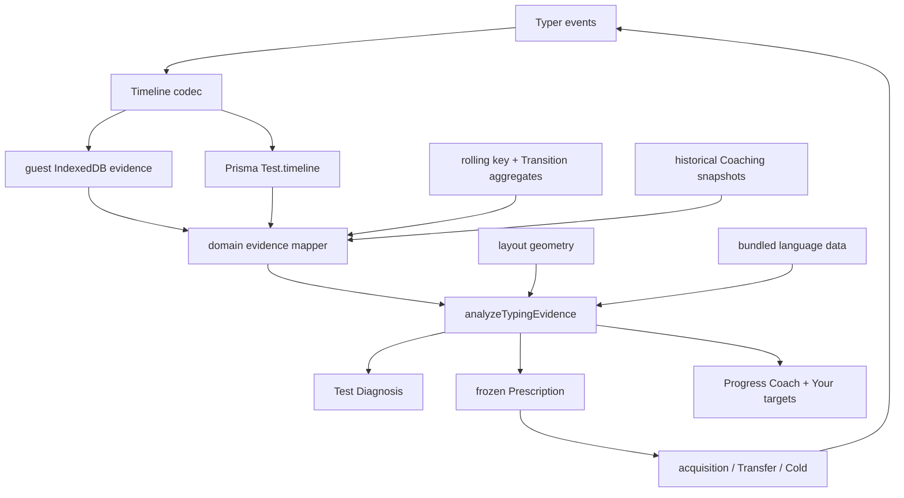

# Adaptive skill coaching

**Status:** planned · **Owner:** product loop · **Depends on:** daily coaching,
full Test timelines, rolling key/Transition aggregates, local-first guest data

## Product contract

TypeCafe chooses the highest-Impact typing Target it can support with honest
evidence, gives the user focused acquisition sets, checks the same Target in
varied text, and returns to it cold on a later day. The product remembers what
was trained and shows whether it transferred, held, became due, or regressed.

This extends the existing loop rather than replacing it:

```text
Measure a Test
  -> diagnose candidate Weaknesses
  -> rank them by Impact and confidence
  -> freeze one Target into today's Prescription
  -> acquire it in dense Drill sets
  -> Transfer check in varied text
  -> Cold check on a later day
  -> record Mastery or regression
  -> show the proof in Progress
```

The user-facing promise is:

> "TypeCafe found what cost me the most, trained it, checked it in real text,
> and remembered whether the improvement held."

The plan is successful only if it makes practice more efficient or makes
retained improvement more visible. More charts, labels, or generated content
without a better Target decision do not count.

## Why this is the next product layer

The current product already has the hard foundation: full signed-in keystroke
timelines including Backspaces; rolling per-key accuracy and Transition
latency/error aggregates; actionable per-Test Diagnosis; targeted key,
Transition, and word Drills; a frozen Daily Coaching Prescription with repeated
sets and next-day Cold checks; configuration and progression history; and guest
mirrors for current aggregate evidence.

But the current decision collapses this evidence into "slowest Transition first,
weakest keys second." It does not rank by real cost, use Transition errors,
remember Mastery, distinguish drill-context performance from natural transfer,
or model higher-order patterns such as Grams, hard words, corrections, movement
patterns, and endurance.

The result is a strong Diagnose -> Drill handoff without a durable answer to:

- Which Weakness buys the most improvement per minute?
- What kind of failure is it?
- Did focused practice transfer to unfamiliar text?
- Did it hold the next day?
- What has the user already fixed?
- What is due for a short refresh instead of another general Test?

## Locked product decisions

These are the defaults for implementation. Change one only with evidence and,
when it changes a load-bearing constraint, an ADR update.

1. **Impact, not raw slowness, chooses the Target.** A rare 2x-slow pair can
   rank below a common 1.3x-slow Gram when the common pattern costs more time.
2. **Natural typing, focused practice, and checks are distinct evidence
   contexts.** Drill reps may keep feeding responsive rolling aggregates (ADR
   0004), but they cannot independently prove transfer or Mastery.
3. **One primary Target per Coaching session.** Secondary work may support it,
   but the proof and return hook stay legible.
4. **Dense practice acquires; varied text proves transfer; delayed text proves
   retention.** A warm in-Drill Delta is feedback, not learning proof.
5. **Mastery is evidence, not a reward.** No XP, levels, badges, celebratory
   inflation, or permanent "completed" status.
6. **Due checks outrank new Weaknesses.** The coach protects prior gains before
   introducing more work.
7. **A regressed Target re-enters normal Impact ranking.** It is not permanently
   pinned and does not erase its earlier proof.
8. **No LLM or paid analysis.** All Findings are deterministic pure functions
   over local evidence, layout geometry, and bundled language data.
9. **Guest coaching remains first-class.** New evidence must work locally before
   signup and converge safely on signup.
10. **The app never claims to observe the user's actual finger.** Layout geometry
    can name the expected movement pattern; only hardware telemetry could name
    the finger actually used.
11. **Every Finding ends in an action.** Unsupported or undrillable observations
    stay hidden rather than becoming trivia.
12. **Every number has one definition and one owner in `src/lib/`.** Thresholds,
    evidence contexts, sample floors, outlier handling, and Impact calculation
    are public on `/how-we-measure` and unit-tested.

## Non-goals

- realtime multiplayer, classroom features, or premium coaching;
- generic AI-written advice;
- a large static five-gram leaderboard;
- pretending a prescribed finger is the finger the user actually used;
- scoring arbitrary free-form text or recording system-wide keystrokes;
- email, cron, or paid reminders;
- another dashboard of vanity metrics without Drill or Check actions;
- replacing Train's beginner ladder;
- changing keyboard input or remapping the OS layout;
- building code-specific curriculum before natural-language coaching works.

## Domain model

The canonical terms are recorded in `CONTEXT.md`.

### Evidence context

Every evidence-bearing Test or Drill rep is classified before analysis:

| Context | Meaning | Discover Weakness | Update response | Prove Transfer | Prove Mastery |
|---|---|---:|---:|---:|---:|
| `natural` | Ordinary generated text outside focused coaching | yes | no | no | no |
| `diagnostic` | Coverage-shaped calibration Test | yes | no | no | no |
| `acquisition` | Target-saturated Drill set | no | yes | no | no |
| `transfer` | Varied text with bounded Target exposure | no mid-session | yes | yes | no |
| `cold` | Delayed Target check before practice | no mid-session | yes | yes | yes |
| `train` | Beginner Level attempt | no | no | no | no |
| `grams` | User-directed Grams mode outside a Prescription | no initially | future | no | no |

Existing rolling aggregates continue to accept normal Drill reps per ADR 0004.
The new analysis reads context-tagged timelines when deciding transfer and
Mastery, so responsive heatmaps do not become dishonest learning proof.

### Target kinds

The domain Target is broader than today's `DrillTarget` wire type:

```ts
type CoachingTarget =
  | { kind: "key"; keys: string[]; metric: "accuracy" | "latency" }
  | { kind: "transition"; pair: string; metric: "latency" | "accuracy" }
  | { kind: "gram"; gram: string }
  | { kind: "word"; words: string[]; sharedGram?: string }
  | { kind: "movement"; movement: MovementKind; anchors: string[] }
  | { kind: "correction"; expected: string; typed: string }
  | { kind: "endurance"; shortSeconds: number; longSeconds: number }
```

`CoachingTarget` is the domain shape. Query-string parsing, Prisma JSON, and
legacy `{ kind: "keys" | "transition" }` snapshots translate at their seams;
wire names do not leak through the pure logic.

### Mastery state

Each previously prescribed Target derives one current state:

| State | Evidence |
|---|---|
| `training` | prescribed or practiced, but no qualifying Transfer check yet |
| `transferred` | varied-text check beat the frozen baseline |
| `retained` | a later Cold check remained better than the frozen baseline |
| `due` | retained Target reached its next derived check date |
| `regressed` | qualifying natural or Cold evidence crossed back over the Weakness threshold |

Mastery is the proof represented by a retained Target. Later natural or Cold
evidence can regress it; no permanent completion flag is stored.

Initial spaced-check intervals are deterministic and deliberately small:

```text
Transfer improved -> Cold check next local day
Cold held once    -> due in 3 practiced days
Cold held twice   -> due in 7 practiced days
Cold missed       -> return to normal Impact ranking immediately
```

Use practiced days, not wall-clock days, after the first next-day check. A
vacation should not turn the app into a wall of overdue work.

### Finding and proof

A candidate becomes a Finding only when it has a supported Target kind, a
trustworthy sample, material Impact, a frozen baseline, an available action,
and evidence-safe copy. No unsupported observation is shown as a diagnosis.

```ts
interface TargetProof {
  target: CoachingTarget
  metric: "ms" | "%" | "wpm"
  baseline: number
  bestAcquisition?: number
  transfer?: number
  cold?: number
  improvedInTransfer: boolean
  heldCold: boolean | null
  sampleCounts: { baseline: number; transfer: number; cold: number }
}
```

No WPM headline may stand in for a Transition, key-accuracy, or correction
Target. Compare like with like.

## Evidence inventory and opportunities

| Evidence available | Current use | Planned use |
|---|---|---|
| expected character, correctness, inter-key delta | score, key/Transition analysis | Grams, words, hesitation windows, movement, robust rhythm |
| Backspace action and timing | authoritative replay | corrected errors, correction reaction and cost |
| actual typed character (ephemeral) | result typed text | persisted confusion matrix for incorrect attempts |
| Transition error count | returned as `errorRate` | inaccurate-Transition Findings and Impact |
| word boundaries | per-Test toughest words | recurring words, starts/ends, shared-Gram families |
| layout id and geometry | board, heatmap, teaching | expected hand/finger/row/reach/roll classes |
| count + Test options | result metadata | endurance and punctuation/capital/number cost |
| WPM samples | result chart, Consistency | warm-up ramp, late fade, pause distribution |
| Coaching snapshots | today + yesterday | Mastery history, due checks, regression |
| Grams level state | current mount only | personalized Gram review after core Targets ship |

## Measurement definitions

All constants live beside the pure calculation and are documented publicly.
The values below are initial defaults; change them only with tests and observed
false-positive/false-negative evidence.

### Robust event preparation

Before candidate generation:

1. decode legacy and current Timeline formats to one domain event stream;
2. replay Backspaces while retaining every attempted event and its context;
3. exclude the first committed keystroke from latency metrics;
4. split at spaces and sentence boundaries;
5. classify evidence context and layout;
6. exclude non-positive deltas;
7. exclude interruption gaps above the smaller of 2,000ms or the Test median
   plus six median absolute deviations;
8. retain excluded gaps for an "interrupted sample" quality flag, never a
   Weakness;
9. keep corrected attempts for correction metrics but do not double-count them
   as final-text occurrences.

### Initial confidence floors

| Candidate | Minimum sample | Diversity requirement |
|---|---:|---|
| key accuracy | 20 attempts | at least 2 Tests unless diagnostic |
| key latency | 15 timed arrivals | at least 2 predecessor keys |
| Transition | 8 occurrences | at least 2 Tests or 4 distinct words |
| trigram | 5 occurrences | at least 2 Tests and 3 distinct words |
| tetragram | 4 occurrences | at least 2 Tests and 2 distinct words |
| word | 3 occurrences | at least 2 Tests |
| movement class | 30 occurrences | at least 4 concrete sequences |
| correction confusion | 3 errors | at least 2 Tests |
| endurance | 3 short + 3 long Tests | same language, pool, and option family |

Diagnostic coverage may satisfy Test diversity only for first prescription
discovery; it cannot satisfy Transfer or Mastery.

### Baselines and Impact

- Latency compares with the user's robust natural-evidence median for the same
  language and stats pool.
- Accuracy compares with the recent rolling rate; proof freezes the exact value
  at Prescription creation.
- Gram latency is the sum of internal deltas compared with expected per-arrival
  baselines, not synthetic "Gram WPM."
- Word cost excludes the pre-word cognitive pause unless the Target is
  explicitly word-start rhythm.
- Endurance compares matched Test families only.

Candidate Impact estimates time lost per 1,000 natural characters:

```text
latencyCost = max(observedMs - baselineMs, 0) * occurrencesPer1000
errorCost   = errorRate * medianPersonalCorrectionCostMs * occurrencesPer1000
rawImpactMs = latencyCost + errorCost
Impact      = rawImpactMs * confidence * recencyWeight
```

- Occurrence rate comes from natural Tests when sufficient, otherwise from the
  bundled active-language corpus.
- Personal correction cost comes from error -> Backspace -> corrected episodes;
  until available, use three times the user's robust median inter-key latency.
- Confidence rises with count and distinct Tests/words, capped at 1.
- Recency is volume-based, aligned with ADR 0005; time away does not erase data.
- Translate Impact to approximate WPM only when the evidence supports it.

Ties resolve by: due Target, natural frequency, confidence, fewer unsuccessful
sessions, then stable target id.

### Transfer and retention

A target metric improves when it is directionally better and clears the greater
of a metric-specific noise floor or 5% relative. Initial noise floors are 10ms
latency, 1 percentage point Accuracy, and 1 WPM endurance. A Cold check holds
when it remains better than the frozen baseline by that floor; it need not beat
the warm Transfer result.

## Deep-module design

### External seam: `src/lib/skillEvidence.ts`

The evidence knowledge belongs behind one pure module interface:

```ts
export function analyzeTypingEvidence(input: SkillEvidenceInput): SkillAnalysis
```

Callers provide domain data, not Prisma rows, localStorage values, query strings,
or React state. The result contains:

```ts
interface SkillAnalysis {
  quality: EvidenceQuality
  candidates: SkillCandidate[]
  recommendation: SkillCandidate | null
  mastery: MasteryRecord[]
  recap: SkillRecap
}
```

This module owns replay/context separation, robust sample preparation, candidate
generation, confidence, Impact, due/regressed derivation, recommendation, proof,
and user-safe reason codes. It does not own persistence, tRPC, React copy,
text compilation, query parsing, or analytics delivery.

The deletion test passes: without it, these rules would reappear in Diagnosis,
Daily Coach, Progress, and profile callers. Tests exercise this public
interface; internal helpers stay private unless a second real caller appears.

### Supporting deep modules

1. `src/lib/keystrokes.ts` remains the Timeline codec/compatibility seam.
2. `src/lib/keyboardLayout.ts` remains the geometry seam and gains the smallest
   useful movement interface, likely `movementFor(from, to, layout)`.
3. `src/lib/drill.ts` remains text compilation and accepts a Target plus
   acquisition/Transfer/Cold policy.
4. `src/lib/dailyCoaching.ts` remains the frozen-Prescription module and consumes
   `SkillAnalysis.recommendation`; it never learns candidate math.

Do not add a repository ports/adapters layer around tRPC. ADR 0002 still holds.
Guest/DB data normalizes in existing hooks/router mappers before crossing the
pure evidence seam.



## Persistence plan

### Timeline v2

The recorder receives the actual typed character but persists only expected
character and correctness. Add a backward-compatible v2 encoding:

```ts
type EncodedTimelineV1 = [expectedCodeUnit, state, dtMs][]
type EncodedTimelineV2 = {
  v: 2
  events: [expectedCodePoint, typedCodePointOrZero, state, dtMs][]
}
```

Zero means "same as expected" on correct attempts; Backspace keeps state 2 with
zero character codes. Readers accept both versions and writers emit v2. Existing
rows require no backfill and can produce every candidate except specific
expected/actual confusion. Continue recording only prompted copy-task input.

The implementation slice updates ADR 0001's storage wording and privacy copy for
actual mistyped characters and keystroke timing.

### Guest Timeline store and signup

Use native IndexedDB, not a dependency or oversized localStorage values:

```ts
interface GuestEvidenceTest {
  localId: string
  completedAt: number
  context: EvidenceContext
  config: TestConfiguration
  timeline: EncodedTimeline
}
```

Rules:

- retain newest 200 evidence Tests or 20MB, whichever is lower;
- evict oldest non-Coaching natural Tests first;
- write in the existing idle analytics path;
- read through an extension of `useGuestEvidence`;
- blocked/unavailable IndexedDB leaves aggregate coaching functional;
- batch signup import at 25 Timelines per request;
- server re-derives metrics and stores imported evidence unranked;
- preserve completion date/context for skill history;
- clear only confirmed batches and make retries idempotent.

Keep existing daily/key/Transition/Train/Coaching imports. Imported guest
Timelines never enter leaderboards, percentiles, or Bests.

### Historical reads

Add bounded latest-Timeline reads and `coachingSession.getHistory` by
language/pool, newest first, default 30 and maximum 90 sessions. Return parsed
domain data, never arbitrary JSON. Do not create a parallel Mastery table until
query volume or product behavior proves it necessary.

Derived-on-read remains the free-tier default: rolling aggregates answer what is
weak now; natural Timelines answer what costs time; Coaching history answers what
was trained and retained; full Timelines remain the future backfill source.

## Coaching-session design

### Selection and steps

At local-day creation choose: due Cold check, materially regressed Target,
highest-Impact candidate, then coverage calibration. Freeze the recommendation,
baseline, thresholds, evidence counts, and reason per ADR 0007.

Default 5-8 minute targeted session:

```text
1. Cold check due Target, if any              1 set
2. Warm measure or adopt qualifying Test      30s / 25+ words
3. Acquisition on primary Target              2 wins or 3 sets
4. Transfer check in varied text              1 set
5. Optional secondary key cleanup             only under 8 minutes
6. Proof: baseline -> acquisition -> Transfer; tomorrow line
```

If the Cold Target is also highest Impact, its Cold set happens before practice
and can become today's acquisition baseline. Failure to improve is a valid,
bounded outcome. Global WPM is secondary unless the Target is endurance.

### Calibration

Replace the claim that an arbitrary 60-second Test always maps the user. Generate
a deterministic diagnostic prompt maximizing coverage of active-language keys,
common trackable Transitions, word boundaries, enabled symbols, reachable
accents, and varied movement classes. It may honestly end with "more evidence
needed" for higher-order Targets while still showing a supported key/Transition.

### Drill policies

| Target | Acquisition | Transfer/Cold |
|---|---|---|
| key accuracy | target-quota real-word carriers | unseen carriers at natural density |
| key latency | varied predecessor/successor contexts | unseen natural words |
| Transition latency | dense pair carriers | unseen pair words at bounded density |
| Transition accuracy | pair carriers with no-rush goal | unseen pair carriers |
| Gram | whole-Gram words, not naked repetition only | unseen word families |
| word family | shared Gram across several words | unseen members or normal mixed text |
| movement | concrete sequences sharing movement | different sequences in same class |
| correction | confused key in prior contexts, 100% goal | mixed unseen contexts |
| endurance | sustainable long Test after short baseline | matched later long Test |

Movement and correction Drills display concrete characters/words; the internal
classification explains practice but is not itself the practice material.

## User-facing surfaces

### Test result

- Order Findings by estimated cost rather than fixed kind.
- Distinguish slow and inaccurate Transitions.
- Show corrected-error count/cost when material.
- Show at most one higher-order Gram/word Finding initially.
- Keep direct Drill and Re-measure actions.
- Never show Mastery from one Test.

### Today

- Name Target, Impact, and evidence in the reason line.
- Label Cold, warm measure, focus, and Transfer steps plainly.
- Compare the Target metric across all stages.
- State whether Transfer improved and an earlier Cold check held.
- State the next check without promising tomorrow's Target.

### Progress

Keep the existing WPM Delta, Goal, Trend, and keyboard proof on the left and
replace the legacy aggregate "Weak spots" column with one adaptive Coach column.
At wide desktop sizes the Coach receives roughly 40-45% of the content width.
Remove Records from Progress entirely: milestone chronology does not explain why
the user improved or what to do next, while the WPM chart already preserves the
useful speed history. The colours remain theme tokens, not a hard-coded Coach
palette.

The Coach column has two related but distinct jobs:

1. **Next action.** Its default `Coach · Next action` state shows the frozen or
   prospective priority in the same order as session creation: due Cold check,
   regressed Target, then highest-Impact supported Target. If today's work just
   transferred and no action is due, show `Coach · Latest result`; use calibration
   only when neither a current Target nor coached proof exists. This is the Target
   selected by the coach, not merely the first list row.
2. **Target detail.** Selecting a row in "Your targets" temporarily
   projects that Target's proof into the upper card. This is inspection only: it
   never changes today's frozen Prescription, recommendation order, Mastery, or
   persisted evidence. The card becomes `Target detail` and keeps an explicit
   `Back to next action` control naming the real coach priority.

The Target row selected for inspection gets a neutral selection treatment. The
actual next action keeps its semantic due/regressed accent even while another
row is inspected, so selection cannot masquerade as reprioritization. If a
filter hides the inspected row, reset the detail card to the next action.

Add one bounded "Your targets" list, not separate Weakness and Coaching-history
surfaces:

- merge current supported weaknesses from ordinary natural Tests with coached
  Mastery by stable Target identity, producing no duplicate row;
- show an uncoached weakness as `Needs work` with its recent observed metric and
  a direct practice action, so Coach participation is optional;
- when coached proof exists for the same Target, preserve its latest Mastery
  state and expandable qualifying episodes;
- expand a Target to inspect older qualifying Coaching episodes;
- label current natural evidence `Recent` rather than claiming all-time coverage
  from the bounded Timeline/Coaching reads;
- prefer `All`, `Needs action`, and `Held` filters over engine-kind tabs that
  cannot cleanly cover correction, movement, word, and endurance Targets;
- order due, regressed, current Needs-work (Impact-ranked), training,
  transferred, then retained Targets;
- show at most five rows before disclosure on narrow screens;
- no badges, XP, permanent "fixed" language, or completion percentage.

Do not add a separate Recent Recap card or Home reminder. It repeats the Delta,
Coach action, and Target proof already visible on Progress without adding a new
decision.

Each projected state has one evidence-safe comparison and action:

| State | Proof shown | Action |
|---|---|---|
| `needs-work` | recent supported natural evidence | direct Target practice; guided Coach remains available above |
| `training` | frozen baseline -> best acquisition, labelled practice rather than proof | `Continue` -> `/plan` |
| `transferred` | frozen baseline -> qualified Transfer | `View proof`; state when its Cold check becomes eligible |
| `retained` | frozen baseline -> latest held Cold check | `View proof`; do not prescribe redundant Drill work |
| `due` | frozen baseline -> latest qualifying Transfer/Cold result | `Check it` -> `/plan` so the delayed result can advance Mastery |
| `regressed` | prior retained proof -> failed Cold or matched current natural evidence | `Refresh it`; use `/plan` when it is today's Target, otherwise honest acquisition practice |

Comparisons always read chronologically left-to-right. Metric direction, colour,
icon, and status copy explain whether the change was good; arrow direction never
reverses. Name the stages (`Baseline`, `Transfer`, `Cold`, or `Recent`) and show
like with like: milliseconds for latency, percentage points for Accuracy/error
rate, and WPM only for endurance. Acquisition may be supporting context but can
never be styled as retained proof.

A single Target may state its estimated `impactMsPer1000`, with "estimated" in
the copy. Do not sum Impact across overlapping Targets, attribute global WPM to
Drills, call retained Targets "fixed," or promise a fixed action duration unless
the rendered session actually derives it. Safe summary counts include completed
Coaching sessions, latest-unique retained gains, and checks currently due.

On desktop, row selection uses the upper-card master/detail interaction. Match
the Coach column to the measured height of the complete left proof column and
scroll only the Target rows beneath the fixed detail/header region. On mobile,
tapping a row expands the same detail inline beneath it; do not make the user
scroll back to an off-screen upper card and do not create a nested scrolling
region. Mobile order is WPM proof -> Coach next action -> Trend -> Your targets
-> keyboard.

The Progress period selector continues to scope WPM/Goal proof. The Target list
remains an explicitly bounded recent skill view unless a future
unbounded read makes an `All` claim true. Keep global WPM proof separate from
Target proof: the page must never imply that its WPM Delta was caused by the
Drills shown beside it.

Wire Stance only when it changes acquisition policy. Show an endurance gap only
after matched samples, with an action into an endurance Target session.

## Analytics and success

Add privacy-minimized events; send Target kind/outcome, never characters, words,
or target ids:

| Event | Properties |
|---|---|
| `diagnosis_shown` | finding kinds, evidence quality, has action |
| `finding_action_clicked` | kind, source surface |
| `coaching_started` | session kind, has Cold, Target kind |
| `acquisition_set_completed` | kind, improved, sample qualified |
| `transfer_completed` | kind, improved, sample qualified |
| `cold_check_completed` | kind, held, practiced-day delay |
| `coaching_completed` | minutes, sets, Transfer/Cold outcomes |
| `mastery_state_changed` | kind, from state, to state |

**North-star:** retained Target improvement per active Coaching minute.

Learning metrics: Transfer improvement rate, first-Cold hold rate, seven-
practiced-day retention, minutes to retained Target, natural Impact reduction,
regression by Target kind, and calibration yield.

Product metrics: session start/completion, next-day return after improved
Transfer, return when Cold is due, D7 return after first retained Target, direct
Target-practice action, and guest signup after retained proof.

Guardrails: Diagnosis action rate, 5-8 minute median session, no unsupported
claims, one canonical WPM, no typing-path/first-paint regression, and no Test
blocked by storage/import failure.

## Delivery ledger

Each slice is one focused, verified Conventional Commit on `development`. UI
slices update e2e coverage and the screenshot tour in the same commit.

### 0. Measurement trust prerequisite

- [x] Make canonical net WPM the Progress value for signed-in records by reading
      `Test.score`, not raw `Test.speed`; regression-test the router mapping.
- [x] Version guest progress entries: old entries are known raw WPM and convert
      through `netFromRaw(wpm, accuracy)` on read; new entries store net WPM.
- [x] Verify DailyUserStat v2, profile proof, Goals, plateaus, Progress shares,
      and Coaching baselines consume the same canonical number.
- [x] Replace the unsupported plateau sentence about "comfortable words" with
      evidence-safe copy until lexical variety is measured.
- [x] Update `/how-we-measure`, unit tests, Progress e2e, and screenshots.

**Acceptance:** a Test with raw 100 WPM / 90% Accuracy appears as 80 WPM on its
result, guest Progress, signed-in Progress, imported history, share, and Goal.

### 1. Timeline v2 and correction evidence

- [x] Extend recorder/domain events with actual typed character while keeping
      expected character and correctness.
- [x] Implement v1/v2 encode/decode compatibility and router validation.
- [x] Keep anti-cheat, replay, WPM, Accuracy, Consistency, and ranking behavior
      equivalent for legacy evidence.
- [x] Add pure correction episodes: error -> Backspaces -> corrected character,
      reaction time, cost, and expected/typed confusion.
- [x] Test repeated Backspaces, over-correction, first-key errors, Unicode,
      impossible deltas, and mixed v1/v2 history.
- [x] Update privacy copy and ADR 0001 evidence wording in the implementation
      commit.

**Acceptance:** new incorrect attempts produce confusion/correction evidence;
old Timelines render and score identically; correct attempts stay compact.

### 2. Guest full-evidence mirror and import

- [x] Add native IndexedDB Guest Timeline store with caps, validation, ordered
      eviction, and graceful degradation.
- [x] Extend `useGuestEvidence` without leaking IndexedDB mechanics to pages.
- [x] Record config, context, time, layout, language, and Timeline for eligible
      guest Tests and Drills.
- [x] Add bounded idempotent signup import; server re-derives metrics and marks
      imported evidence unranked.
- [x] Clear only confirmed batches and retry partial failures.
- [x] Add store tests and guest -> signup -> signed-in e2e.

**Acceptance:** guest correction/Gram evidence analyzes identically after signup,
never ranks publicly, and is not duplicated by retry.

### 3. Evidence contexts and historical inputs

- [x] Add domain `EvidenceContext`; translate existing modes/routes without
      changing competitive Test types.
- [x] Freeze context into new Guest evidence and Coaching snapshots.
- [x] Add bounded latest-Timeline query scoped by language and stats pool.
- [x] Add bounded Coaching-history query and validate snapshots before return.
- [x] Characterize legacy evidence conservatively: ranked normal -> natural,
      known Coaching steps -> their context, otherwise no Mastery proof.
- [x] Test identical guest/DB domain normalization fixtures.

**Acceptance:** natural, acquisition, Transfer, and Cold samples cannot be
mistaken for one another across reload or signup.

### 4. Deep evidence module v1

- [x] Create `analyzeTypingEvidence` with robust preparation, quality,
      confidence, Impact, and stable tie-breaking.
- [x] Generate key latency/accuracy, Transition latency/accuracy, and correction
      candidates.
- [x] Use Transition error rate in recommendations.
- [x] Separate natural baseline from acquisition response despite ADR 0004's
      shared rolling aggregates.
- [x] Return reason codes/data; React owns prose.
- [x] Replace pair-first selection in Daily Coach/Home, retaining a legacy
      fallback for thin history.
- [x] Publish thresholds and Impact on `/how-we-measure`.

**Acceptance:** a common 1.4x pair can outrank a rare 2x pair; a high-error,
normal-speed pair can become a Target; Drill errors cannot invent a natural
Weakness.

### 5. Higher-order evidence: Grams and words

- [x] Generate trigram/tetragram candidates from within-word natural events.
- [x] Enforce Test/word diversity and interruption filtering.
- [x] Compute internal excess latency, not synthetic Gram WPM.
- [x] Aggregate recurring hard words and shared-Gram word families.
- [x] Prune below confidence early and cap candidates per kind/payload.
- [x] Add active-language corpus priors using bundled word data.
- [x] Show at most one higher-order result Finding with an action.

**Acceptance:** a personally slow common `tion` across several words can outrank
its pairs; a one-off slow word cannot become a Finding.

### 6. Movement and endurance evidence

- [x] Add prescribed movement classification behind `keyboardLayout.ts`: hand,
      assigned finger, row change, same-finger, reach, and roll direction.
- [x] Require four concrete sequences for a movement candidate.
- [x] Say "this movement" or "these keys," never claim an observed finger.
- [x] Add matched Test-family endurance and punctuation/capital/number costs.
- [x] Keep language, pool, Test kind, and options fixed in comparisons.
- [x] Defer key-up/hold/overlap capture as a later upgrade.

**Acceptance:** QWERTY and Colemak classify the same text through their own
geometry; unmatched short/long Tests produce no endurance claim.

### 7. Target-general Drill and Check compilation

- [x] Expand the domain Target and legacy query parser without breaking existing
      key, Transition, word, and re-measure links.
- [x] Make `compileDrillText` accept Target plus acquisition/Transfer/Cold policy.
- [x] Guarantee sample quotas and novel carrier words for checks.
- [x] Give acquisition and varied checks different density caps.
- [x] Add accuracy policy for inaccurate Transition/correction Targets.
- [x] Add movement carriers using several concrete sequences.
- [x] Add matched endurance handoff to the normal Test surface.
- [x] Ensure every returned Target can compile content and an action.

**Acceptance:** acquisition saturates; Transfer/Cold use unseen, natural-looking
carriers with qualified samples; reload preserves frozen Target/policy.

### 8. Daily Coach Transfer loop

- [x] Select due -> regressed -> highest Impact -> calibration.
- [x] Freeze recommendation, baseline, thresholds, and reason in a backward-
      compatible Coaching snapshot version.
- [x] Add Transfer after acquisition and adopt only verified context/coverage.
- [x] Preserve two wins or three acquisition sets.
- [x] Keep median session within 5-8 minutes.
- [x] Update Today/Home/Drill, desktop/mobile e2e, and screenshots.

**Acceptance:** warm acquisition improvement without Transfer improvement is
practice progress, not Mastery; today's Prescription never changes underneath
the user.

### 9. Mastery derivation and due checks

- [x] Derive training/transferred/retained/due/regressed from snapshots and
      natural evidence; store no permanent completion flag.
- [x] Schedule next-day, 3-practiced-day, and 7-practiced-day checks.
- [x] Prioritize due checks and re-rank missed Cold Targets.
- [x] Scope Mastery correctly across languages and layout pools.
- [x] Test vacations, missed days, repeated Targets, partial sessions, layout
      changes, and regression.

**Acceptance:** no retained state without delayed qualified evidence; time away
neither erases proof nor creates a wall of overdue checks.

### 10. Progress Targets and Mastery history

- [x] Extract a read-only shared evidence/history analysis hook for Daily Coach
      and Progress; rendering Progress must not create or freeze a session, and
      today's live snapshot must be merged while bounded history catches up.
- [x] Add a pure Progress projection that merges supported current weaknesses
      and repeated Mastery episodes by Target identity, selects the real next
      action, chooses state-specific proof stages, and formats metrics consistently.
- [x] Replace legacy "Weak spots" with `Coach · Next action`, add bounded
      `Your targets`, and remove Records from Progress.
- [x] Add desktop master/detail inspection with `Back to next action`; selection
      must never mutate today's frozen Prescription or hide the coach priority;
      match left-column height and scroll only the Target list.
- [x] Add mobile inline Target detail and disclosure with no nested scrolling.
- [x] Give every due/regressed state a Check/Refresh action; due Cold checks go
      through `/plan`, while retained/transferred rows show proof rather than
      prescribing redundant Drill work.
- [x] Reject unsupported UI claims: summed seconds saved, WPM attributed to
      Drills, permanent "fixed" counts, reversed chronology arrows, and
      underived duration promises.
- [x] Remove the duplicate Recent Recap card and Home reminder after product
      review; Progress Delta, Coach, and `Your targets` own those answers.
- [x] Keep Stance absent until it changes acquisition policy.
- [x] Allow endurance through Progress only with the existing matched-evidence
      candidate and actionable Coach route.
- [x] Add unit, accessibility, desktop/mobile e2e, and screenshots.

**Acceptance:** a returning user can answer what improved, whether it held, and
what to do next without interpreting a chart. They can inspect another Target's
proof without changing the coach's recommendation; returning to the next action
restores the same frozen priority and action. Every displayed comparison is
metric-correct, chronological, stage-labelled, and identical for guest and
signed-in evidence.

### 11. Funnel instrumentation and guarded rollout

- [ ] Add the event vocabulary without Target contents.
- [ ] Baseline Diagnosis action, Drill/session completion, return, and duration.
- [ ] Run analysis in shadow mode before changing prescriptions.
- [ ] Compare shadow recommendation with the current pair-first choice.
- [ ] Enable new kinds one at a time: correction, Gram/word, movement, endurance.
- [ ] Tune thresholds only after real Transfer/Cold outcomes, through pure
      functions with tests.

**Acceptance:** the team can tell whether retained learning and return behavior
improved, not merely whether users clicked the new UI.

## Verification matrix

Every completed slice runs its focused checks plus the full gate before commit:

```text
npx vitest run
npm run lint
npm run build:check
npx playwright test
npx playwright test tests/e2e/screenshots.spec.ts
```

| Area | Unit/property tests | E2E |
|---|---|---|
| WPM trust | raw/net migration, mixed history, shares/goals | guest/signed-in equality |
| Timeline v2 | roundtrip, replay equivalence, malformed input | result and reload |
| Guest store | cap, eviction, partial/import retry | guest -> signup convergence |
| Impact | frequency, confidence, error, cost, outliers | same Finding across surfaces |
| Grams/words | overlap, boundaries, diversity, Unicode | Finding -> Drill |
| Movement | every layout, ISO/ANSI, remaps | layout isolation |
| Transfer | novelty, quota, metric direction | acquisition -> Transfer proof |
| Mastery | delay, due, held, missed, regression | day-1/day-2 fixtures |
| Progress Targets | source merge, identity, ordering, proof/action fallbacks | inspect and practise |

Use deterministic domain fixture builders instead of long inline arrays. Tests
cross the public module interface; private scoring helpers do not become exports
for test convenience.

## Migration and compatibility

- Timeline v1 remains readable indefinitely; no row rewrite is required.
- `Test.score` already provides canonical net WPM; Progress is a read correction.
- Guest progress v1 converts from known raw WPM; v2 marks canonical net.
- Coaching snapshot v2 remains parseable through one compatibility translator.
- Existing query links and re-measure tokens remain valid.
- Rolling aggregates stay responsive/capped; Mastery never reads chronology from
  them (ADR 0005).
- Imported Guest Timelines remain unranked.
- New Target kinds can be disabled without making stored evidence unreadable.

## Risks and mitigations

### False precision

Impact is an estimate. Use conservative floors, robust medians, confidence,
approximate copy, and shadow mode. Never show decimal WPM cost from thin data.

### Drill contamination

ADR 0004 lets Drill reps move rolling aggregates. Context-tagged Timelines keep
acquisition separate from natural/Transfer proof so responsiveness cannot become
false Mastery.

### Candidate explosion

Generate Grams/words/movements only within bounded recent Timelines, prune early,
cap each kind, and return only top candidates. Do not persist every possible Gram.

### Cognitive pauses

Long gaps can be reading, distraction, or motor hesitation. Exclude interruption
outliers and avoid causal copy. Word-start rhythm is its own Target.

### Privacy

Capture only prompted copy-task events, persist actual characters only for
incorrect attempts, bound Guest storage, disclose the evidence, and never send
Target content to analytics.

### Session bloat

Preserve one Target, fixed set cap, one Transfer check, and the 5-8 minute median.

### Cross-layout/language claims

Scope movement and Mastery by pool/language. National layouts may share character
history but classify movement using the recorded layout; remaps never share motor
Mastery.

### Guest failure

IndexedDB is progressive enhancement over existing aggregates. Confirmed-batch
clearing and idempotency prevent loss/duplication; failure never blocks a Test.

## Deferred upgrades

Only consider these after the core ledger proves retained improvement:

- key-up/hold and overlap timing for rollover coordination;
- personalized check intervals learned from retention outcomes;
- token-weighted per-language Gram priors from the language build pipeline;
- code/symbol Transition models and domain-specific corpora;
- a materialized Mastery table if bounded derived reads become expensive;
- public-profile retained-improvement proof;
- free web-push reminders if an honest no-cron schedule becomes available.

## Completion definition

The feature is complete when all ledger boxes are ticked and a guest or signed-in
user can:

1. receive a cost-ranked Target beyond slow pairs/weak keys;
2. understand why it matters;
3. acquire it through focused practice;
4. prove it in varied text;
5. return to a delayed Cold check;
6. see current, retained, due, or regressed evidence in Progress;
7. carry the same evidence through signup;
8. trust one documented definition for every WPM and Target metric;
9. complete the loop without paid services, cron, or an LLM.
