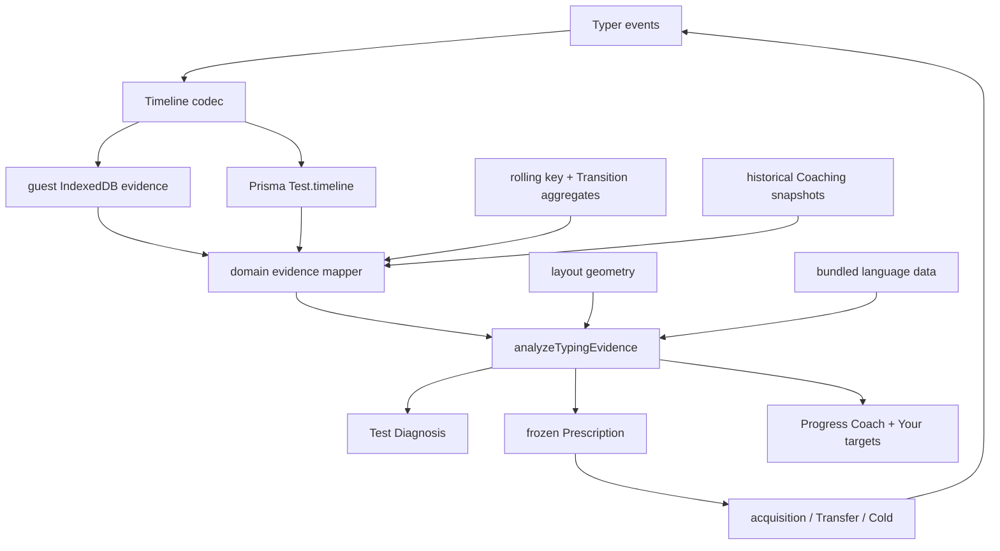

# Adaptive skill coaching

**Status:** planned · **Owner:** product loop · **Builds on:** historical coaching evidence,
full Test timelines, rolling key/Transition aggregates, local-first guest data

## Product contract

TypeCafe chooses the highest-Impact typing Target it can support with honest
evidence, gives the user focused acquisition sets, checks the same Target in
varied text, and returns to it cold on a later day. The product remembers what
was trained and shows whether it transferred, held, became due, or regressed.

This extends the existing loop rather than replacing it:

```text
Measure a Test
  -> diagnose candidate Weaknesses
  -> rank them by Impact and confidence
  -> freeze one Target into today's Prescription
  -> acquire it in dense Drill sets
  -> Transfer check in varied text
  -> Cold check on a later day
  -> record Mastery or regression
  -> show the proof in Progress
```

The user-facing promise is:

> "TypeCafe found what cost me the most, trained it, checked it in real text,
> and remembered whether the improvement held."

The plan is successful only if it makes practice more efficient or makes
retained improvement more visible. More charts, labels, or generated content
without a better Target decision do not count.

## Why this is the next product layer

The current product already has the hard foundation: full signed-in keystroke
timelines including Backspaces; rolling per-key accuracy and Transition
latency/error aggregates; actionable per-Test Diagnosis; targeted key,
Transition, and word Drills; a frozen Daily Coaching Prescription with repeated
sets and next-day Cold checks; configuration and progression history; and guest
mirrors for current aggregate evidence.

But the current decision collapses this evidence into "slowest Transition first,
weakest keys second." It does not rank by real cost, use Transition errors,
remember Mastery, distinguish drill-context performance from natural transfer,
or model higher-order patterns such as Grams, hard words, corrections, movement
patterns, and endurance.

The result is a strong Diagnose -> Drill handoff without a durable answer to:

- Which Weakness buys the most improvement per minute?
- What kind of failure is it?
- Did focused practice transfer to unfamiliar text?
- Did it hold the next day?
- What has the user already fixed?
- What is due for a short refresh instead of another general Test?

## Locked product decisions

These are the defaults for implementation. Change one only with evidence and,
when it changes a load-bearing constraint, an ADR update.

1. **Impact, not raw slowness, chooses the Target.** A rare 2x-slow pair can
   rank below a common 1.3x-slow Gram when the common pattern costs more time.
2. **Natural typing, focused practice, and checks are distinct evidence
   contexts.** Drill reps may keep feeding responsive rolling aggregates (ADR
   0004), but they cannot independently prove transfer or Mastery.
3. **One primary Target per Coaching session.** Secondary work may support it,
   but the proof and return hook stay legible.
4. **Dense practice acquires; varied text proves transfer; delayed text proves
   retention.** A warm in-Drill Delta is feedback, not learning proof.
5. **Mastery is evidence, not a reward.** No XP, levels, badges, celebratory
   inflation, or permanent "completed" status.
6. **Due checks outrank new Weaknesses.** The coach protects prior gains before
   introducing more work.
7. **A regressed Target re-enters normal Impact ranking.** It is not permanently
   pinned and does not erase its earlier proof.
8. **No LLM or paid analysis.** All Findings are deterministic pure functions
   over local evidence, layout geometry, and bundled language data.
9. **Guest coaching remains first-class.** New evidence must work locally before
   signup and converge safely on signup.
10. **The app never claims to observe the user's actual finger.** Layout geometry
    can name the expected movement pattern; only hardware telemetry could name
    the finger actually used.
11. **Every Finding ends in an action.** Unsupported or undrillable observations
    stay hidden rather than becoming trivia.
12. **Every number has one definition and one owner in `src/lib/`.** Thresholds,
    evidence contexts, sample floors, outlier handling, and Impact calculation
    are public on `/how-we-measure` and unit-tested.

## Non-goals

- realtime multiplayer, classroom features, or premium coaching;
- generic AI-written advice;
- a large static five-gram leaderboard;
- pretending a prescribed finger is the finger the user actually used;
- scoring arbitrary free-form text or recording system-wide keystrokes;
- email, cron, or paid reminders;
- another dashboard of vanity metrics without Drill or Check actions;
- replacing Train's beginner ladder;
- changing keyboard input or remapping the OS layout;
- building code-specific curriculum before natural-language coaching works.

## Domain model

The canonical terms are recorded in `CONTEXT.md`.

### Evidence context

Every evidence-bearing Test or Drill rep is classified before analysis:

| Context | Meaning | Discover Weakness | Update response | Prove Transfer | Prove Mastery |
|---|---|---:|---:|---:|---:|
| `natural` | Ordinary generated text outside focused coaching | yes | no | no | no |
| `diagnostic` | Coverage-shaped calibration Test | yes | no | no | no |
| `acquisition` | Target-saturated Drill set | no | yes | no | no |
| `transfer` | Varied text with bounded Target exposure | no mid-session | yes | yes | no |
| `cold` | Delayed Target check before practice | no mid-session | yes | yes | yes |
| `train` | Beginner Level attempt | no | no | no | no |
| `custom-practice` | User-directed Keys or Grams outside a Target | no | item history only | no | no |

Existing rolling aggregates continue to accept normal Drill reps per ADR 0004.
The new analysis reads context-tagged timelines when deciding transfer and
Mastery, so responsive heatmaps do not become dishonest learning proof.

### Target kinds

The domain Target is broader than today's `DrillTarget` wire type:

```ts
type CoachingTarget =
  | { kind: "key"; keys: string[]; metric: "accuracy" | "latency" }
  | { kind: "transition"; pair: string; metric: "latency" | "accuracy" }
  | { kind: "gram"; gram: string }
  | { kind: "word"; words: string[]; sharedGram?: string }
  | { kind: "movement"; movement: MovementKind; anchors: string[] }
  | { kind: "correction"; expected: string; typed: string }
  | { kind: "endurance"; shortSeconds: number; longSeconds: number }
```

`CoachingTarget` is the domain shape. Query-string parsing, Prisma JSON, and
legacy `{ kind: "keys" | "transition" }` snapshots translate at their seams;
wire names do not leak through the pure logic.

### Mastery state

Each previously prescribed Target derives one current state:

| State | Evidence |
|---|---|
| `training` | prescribed or practiced, but no qualifying Transfer check yet |
| `transferred` | varied-text check beat the frozen baseline |
| `retained` | a later Cold check remained better than the frozen baseline |
| `due` | retained Target reached its next derived check date |
| `regressed` | qualifying natural or Cold evidence crossed back over the Weakness threshold |

Mastery is the proof represented by a retained Target. Later natural or Cold
evidence can regress it; no permanent completion flag is stored.

Initial spaced-check intervals are deterministic and deliberately small:

```text
Transfer improved -> Cold check next local day
Cold held once    -> due in 3 practiced days
Cold held twice   -> due in 7 practiced days
Cold missed       -> return to normal Impact ranking immediately
```

Use practiced days, not wall-clock days, after the first next-day check. A
vacation should not turn the app into a wall of overdue work.

### Finding and proof

A candidate becomes a Finding only when it has a supported Target kind, a
trustworthy sample, material Impact, a frozen baseline, an available action,
and evidence-safe copy. No unsupported observation is shown as a diagnosis.

```ts
interface TargetProof {
  target: CoachingTarget
  metric: "ms" | "%" | "wpm"
  baseline: number
  bestAcquisition?: number
  transfer?: number
  cold?: number
  improvedInTransfer: boolean
  heldCold: boolean | null
  sampleCounts: { baseline: number; transfer: number; cold: number }
}
```

No WPM headline may stand in for a Transition, key-accuracy, or correction
Target. Compare like with like.

## Evidence inventory and opportunities

| Evidence available | Current use | Planned use |
|---|---|---|
| expected character, correctness, inter-key delta | score, key/Transition analysis | Grams, words, hesitation windows, movement, robust rhythm |
| Backspace action and timing | authoritative replay | corrected errors, correction reaction and cost |
| actual typed character (ephemeral) | result typed text | persisted confusion matrix for incorrect attempts |
| Transition error count | returned as `errorRate` | inaccurate-Transition Findings and Impact |
| word boundaries | per-Test toughest words | recurring words, starts/ends, shared-Gram families |
| layout id and geometry | board, heatmap, teaching | expected hand/finger/row/reach/roll classes |
| count + Test options | result metadata | endurance and punctuation/capital/number cost |
| WPM samples | result chart, Consistency | warm-up ramp, late fade, pause distribution |
| Coaching snapshots | today + yesterday | Mastery history, due checks, regression |
| Grams level state | current mount only | personalized Gram review after core Targets ship |

## Measurement definitions

All constants live beside the pure calculation and are documented publicly.
The values below are initial defaults; change them only with tests and observed
false-positive/false-negative evidence.

### Robust event preparation

Before candidate generation:

1. decode legacy and current Timeline formats to one domain event stream;
2. replay Backspaces while retaining every attempted event and its context;
3. exclude the first committed keystroke from latency metrics;
4. split at spaces and sentence boundaries;
5. classify evidence context and layout;
6. exclude non-positive deltas;
7. exclude interruption gaps above the smaller of 2,000ms or the Test median
   plus six median absolute deviations;
8. retain excluded gaps for an "interrupted sample" quality flag, never a
   Weakness;
9. keep corrected attempts for correction metrics but do not double-count them
   as final-text occurrences.

### Initial confidence floors

| Candidate | Minimum sample | Diversity requirement |
|---|---:|---|
| key accuracy | 20 attempts | at least 2 Tests unless diagnostic |
| key latency | 15 timed arrivals | at least 2 predecessor keys |
| Transition | 8 occurrences | at least 2 Tests or 4 distinct words |
| trigram | 5 occurrences | at least 2 Tests and 3 distinct words |
| tetragram | 4 occurrences | at least 2 Tests and 2 distinct words |
| word | 3 occurrences | at least 2 Tests |
| movement class | 30 occurrences | at least 4 concrete sequences |
| correction confusion | 3 errors | at least 2 Tests |
| endurance | 3 short + 3 long Tests | same language, pool, and option family |

Diagnostic coverage may satisfy Test diversity only for first prescription
discovery; it cannot satisfy Transfer or Mastery.

### Baselines and Impact

- Latency compares with the user's robust natural-evidence median for the same
  language and stats pool.
- Accuracy compares with the recent rolling rate; proof freezes the exact value
  at Prescription creation.
- Gram latency is the sum of internal deltas compared with expected per-arrival
  baselines, not synthetic "Gram WPM."
- Word cost excludes the pre-word cognitive pause unless the Target is
  explicitly word-start rhythm.
- Endurance compares matched Test families only.

Candidate Impact estimates time lost per 1,000 natural characters:

```text
latencyCost = max(observedMs - baselineMs, 0) * occurrencesPer1000
errorCost   = errorRate * medianPersonalCorrectionCostMs * occurrencesPer1000
rawImpactMs = latencyCost + errorCost
Impact      = rawImpactMs * confidence * recencyWeight
```

- Occurrence rate comes from natural Tests when sufficient, otherwise from the
  bundled active-language corpus.
- Personal correction cost comes from error -> Backspace -> corrected episodes;
  until available, use three times the user's robust median inter-key latency.
- Confidence rises with count and distinct Tests/words, capped at 1.
- Recency is volume-based, aligned with ADR 0005; time away does not erase data.
- Translate Impact to approximate WPM only when the evidence supports it.

Ties resolve by: due Target, natural frequency, confidence, fewer unsuccessful
sessions, then stable target id.

### Transfer and retention

A target metric improves when it is directionally better and clears the greater
of a metric-specific noise floor or 5% relative. Initial noise floors are 10ms
latency, 1 percentage point Accuracy, and 1 WPM endurance. A Cold check holds
when it remains better than the frozen baseline by that floor; it need not beat
the warm Transfer result.

## Deep-module design

### External seam: `src/lib/skillEvidence.ts`

The evidence knowledge belongs behind one pure module interface:

```ts
export function analyzeTypingEvidence(input: SkillEvidenceInput): SkillAnalysis
```

Callers provide domain data, not Prisma rows, localStorage values, query strings,
or React state. The result contains:

```ts
interface SkillAnalysis {
  quality: EvidenceQuality
  candidates: SkillCandidate[]
  recommendation: SkillCandidate | null
  mastery: MasteryRecord[]
  recap: SkillRecap
}
```

This module owns replay/context separation, robust sample preparation, candidate
generation, confidence, Impact, due/regressed derivation, recommendation, proof,
and user-safe reason codes. It does not own persistence, tRPC, React copy,
text compilation, query parsing, or analytics delivery.

The deletion test passes: without it, these rules would reappear in Diagnosis,
Daily Coach, Progress, and profile callers. Tests exercise this public
interface; internal helpers stay private unless a second real caller appears.

### Supporting deep modules

1. `src/lib/keystrokes.ts` remains the Timeline codec/compatibility seam.
2. `src/lib/keyboardLayout.ts` remains the geometry seam and gains the smallest
   useful movement interface, likely `movementFor(from, to, layout)`.
3. `src/lib/drill.ts` remains text compilation and accepts a Target plus
   acquisition/Transfer/Cold policy.
4. `src/lib/dailyCoaching.ts` remains the frozen-Prescription module and consumes
   `SkillAnalysis.recommendation`; it never learns candidate math.

Do not add a repository ports/adapters layer around tRPC. ADR 0002 still holds.
Guest/DB data normalizes in existing hooks/router mappers before crossing the
pure evidence seam.



## Persistence plan

### Timeline v2

The recorder receives the actual typed character but persists only expected
character and correctness. Add a backward-compatible v2 encoding:

```ts
type EncodedTimelineV1 = [expectedCodeUnit, state, dtMs][]
type EncodedTimelineV2 = {
  v: 2
  events: [expectedCodePoint, typedCodePointOrZero, state, dtMs][]
}
```

Zero means "same as expected" on correct attempts; Backspace keeps state 2 with
zero character codes. Readers accept both versions and writers emit v2. Existing
rows require no backfill and can produce every candidate except specific
expected/actual confusion. Continue recording only prompted copy-task input.

The implementation slice updates ADR 0001's storage wording and privacy copy for
actual mistyped characters and keystroke timing.

### Guest Timeline store and signup

Use native IndexedDB, not a dependency or oversized localStorage values:

```ts
interface GuestEvidenceTest {
  localId: string
  completedAt: number
  context: EvidenceContext
  config: TestConfiguration
  timeline: EncodedTimeline
}
```

Rules:

- retain newest 200 evidence Tests or 20MB, whichever is lower;
- evict oldest non-Coaching natural Tests first;
- write in the existing idle analytics path;
- read through an extension of `useGuestEvidence`;
- blocked/unavailable IndexedDB leaves aggregate coaching functional;
- batch signup import at 25 Timelines per request;
- server re-derives metrics and stores imported evidence unranked;
- preserve completion date/context for skill history;
- clear only confirmed batches and make retries idempotent.

Keep existing daily/key/Transition/Train/Coaching imports. Imported guest
Timelines never enter leaderboards, percentiles, or Bests.

### Historical reads

Add bounded latest-Timeline reads and `coachingSession.getHistory` by
language/pool, newest first, default 30 and maximum 90 sessions. Return parsed
domain data, never arbitrary JSON. Do not create a parallel Mastery table until
query volume or product behavior proves it necessary.

Derived-on-read remains the free-tier default: rolling aggregates answer what is
weak now; natural Timelines answer what costs time; Coaching history answers what
was trained and retained; full Timelines remain the future backfill source.

## Coaching-session design

### Selection and steps

At local-day creation choose: due Cold check, materially regressed Target,
highest-Impact candidate, then coverage calibration. Freeze the recommendation,
baseline, thresholds, evidence counts, and reason per ADR 0007.

Default 5-8 minute targeted session:

```text
1. Cold check due Target, if any              1 set
2. Warm measure or adopt qualifying Test      30s / 25+ words
3. Acquisition on primary Target              2 wins or 3 sets
4. Transfer check in varied text              1 set
5. Optional secondary key cleanup             only under 8 minutes
6. Proof: baseline -> acquisition -> Transfer; tomorrow line
```

If the Cold Target is also highest Impact, its Cold set happens before practice
and can become today's acquisition baseline. Failure to improve is a valid,
bounded outcome. Global WPM is secondary unless the Target is endurance.

### Calibration

Replace the claim that an arbitrary 60-second Test always maps the user. Generate
a deterministic diagnostic prompt maximizing coverage of active-language keys,
common trackable Transitions, word boundaries, enabled symbols, reachable
accents, and varied movement classes. It may honestly end with "more evidence
needed" for higher-order Targets while still showing a supported key/Transition.

### Drill policies

| Target | Acquisition | Transfer/Cold |
|---|---|---|
| key accuracy | target-quota real-word carriers | unseen carriers at natural density |
| key latency | varied predecessor/successor contexts | unseen natural words |
| Transition latency | dense pair carriers | unseen pair words at bounded density |
| Transition accuracy | pair carriers with no-rush goal | unseen pair carriers |
| Gram | whole-Gram words, not naked repetition only | unseen word families |
| word family | shared Gram across several words | unseen members or normal mixed text |
| movement | concrete sequences sharing movement | different sequences in same class |
| correction | confused key in prior contexts, 100% goal | mixed unseen contexts |
| endurance | sustainable long Test after short baseline | matched later long Test |

Movement and correction Drills display concrete characters/words; the internal
classification explains practice but is not itself the practice material.

## User-facing surfaces

### Test result

- Order Findings by estimated cost rather than fixed kind.
- Distinguish slow and inaccurate Transitions.
- Show corrected-error count/cost when material.
- Show at most one higher-order Gram/word Finding initially.
- Keep direct Drill and Re-measure actions.
- Never show Mastery from one Test.

### Practice

Practice is the single recommendation-first focused-work destination, not a Test
mode. Drill is a Target-bound guided state of this workspace, not a separate
mode, page, or competing destination. A Finding or Progress Target deep-links
directly into the guided state without visiting the Practice landing view.

Make Practice a first-class primary-navigation destination and remove legacy
Practice from Home's mode selector. The primary order is `Home · Practice ·
Progress · Train · Leaderboard`: Home remains exclusively regular Tests,
Practice owns Guided Drill and Custom Practice, Progress owns proof, and Train
retains restricted-alphabet instruction. Home results and Progress actions may
deep-link into Guided Drill; Practice's measurement action returns to Home.

The page uses the guided-first hierarchy confirmed in the Grams/targeted-practice
design session on 2026-07-19:

1. **Recommended for you.** Lead with one prominent highest-Impact Target from
   the same natural-evidence analysis and ordering used by Progress. Explain the
   measured reason and launch its guided Drill state directly.
2. **Practice your way.** Present Keys and Grams as equal self-directed paths.
   Each path may surface evidence-backed suggestions while preserving manual
   selection.

When natural evidence does not support a Target, replace the recommendation
with `Find your focus` and a `Take a Test` action explaining that TypeCafe needs
a normal Test to identify what is slowing the user down. Never manufacture a
weak key or Gram to fill the card. Custom Keys and Grams remain available below.

Remember the last Custom Keys setup and the last Custom Grams setup separately.
Each self-directed path may offer `Continue`, restoring its selected material,
duration, and `Varied` or `Pseudo` style. Do not add a full Practice-history
dashboard: Practice remains action-first, while Progress owns durable evidence
inspection.

The workspace has two states rather than separate modes: **Guided Drill** and
**Custom Practice**. A guided run preserves the prescribed Target, metric,
frozen baseline, generation policy, and Progress attribution. The visible typing
material is configured through Keys or Grams, but those material choices do not
replace the richer Target taxonomy or evidence contract. Key Targets present as
Keys; Transition, Gram, word-family, movement, and correction Targets use the
Key or Gram presentation appropriate to their concrete material. Endurance is
the exception: it launches the prescribed timed Test rather than Practice.

Changing or combining a guided run's prescribed focus converts it immediately
to Custom Practice and removes Target attribution. The custom run still records
practice activity but does not create a Target, alter natural ability, or prove
improvement. Keys and Grams share the typing runner but own different text
compilation policies. Fresh runs vary the generated text without changing the
evidence contract.

Both self-directed paths use selection-first configuration. TypeCafe preselects
a useful evidence-backed focus set, then the user edits the material directly:
Keys through the keyboard and Grams through mixed-length Gram selections.
Bigrams, trigrams, and tetragrams may coexist in one Gram Practice run. The text
compiler—not the user—owns repetition, distribution, difficulty, and
progression. Remove standalone source, corpus-scope, combination-count,
repetition-count, WPM-threshold, and Accuracy-threshold controls; they expose
generation mechanics rather than a meaningful training choice.

The Grams editor is one mixed selection surface, not separate bigram, trigram,
and tetragram tabs or modes. Show supported natural-evidence suggestions as
selectable chips with a short measured reason; choosing one adds rather than
replaces the current selection. A shared selected-focus tray may contain any mix
of 2-, 3-, and 4-character Grams, with a small length marker on each item, plus
one direct entry control for arbitrary custom Grams. The compiler balances all
selected lengths within the same run.

Initially keep two Gram sources visibly separate. `From your Tests` contains
only exact Gram Targets supported by the user's natural evidence and states the
measured reason. `Common in <language>` exposes corpus-frequency-ranked Grams as
useful Custom Practice material without calling them Weaknesses. Do not infer
that a Gram is weak merely because it contains a weak key or Transition. Users
may mix selections from either source in the shared tray. This two-source
presentation is an initial product choice that may be revisited after usage
evidence; do not blend the claims in the first release.

A Guided Drill is attributed to exactly one Target. Selecting its prescribed
Gram alone may enter Guided Drill; adding any other Gram converts the whole run
to Custom Practice, even when the added Gram is another measured Target. Record
per-item Custom Practice feedback, but do not mark several Targets practised
from one diluted run or move any of them to `practised · awaiting Test`.

A selected key is a focus key, not one member of an allowed alphabet. Keys
Practice generates varied, target-dense text using whatever supporting
characters create useful contexts, so one or several arbitrary keys can be
selected without minimum-count, vowel, or consonant rules. Restricted-alphabet
teaching remains Train's responsibility; do not carry Practice's legacy
"unlocked keys only" behavior into the new compiler.

Custom Keys and Grams Practice uses finite time-based runs with 30-, 60-, 120-,
and 240-second presets, matching Home's seconds-based configuration rhythm;
60 seconds is the initial default. Do
not offer word-count or endless variants initially. Mixed Gram and pseudo-text
content makes word count an unstable description of workload, while a bounded
run creates an intentional feedback point. The compiler continuously supplies
varied text and balances exposure across the selected material for the chosen
duration.

Expose one meaningful text-style choice beside duration, changeable before or
between runs but never mid-run: `Varied` is the default and combines target-dense
real-word carriers with pronounceable pseudo-words when they improve coverage or
context diversity; `Pseudo` uses pronounceable generated tokens only. Changing
style regenerates the prompt. Do not add a third words-only choice or expose
density/repetition controls, and never fall back to naked Gram repetition.

Keep the current Practice mode's strongest interaction in the new destination:
the generated typing text and its configuration share one workspace. The
confirmed `current evolved` layout puts a compact Keys/Grams and duration line
above the runner, keeps the typing text visually dominant, and leaves the direct
keyboard or mixed-Gram editor below it. Starting, editing, or restarting never
navigates to a separate configuration or runner screen. During typing the editor
may visually de-emphasize with the existing focus treatment, but it does not
collapse or leave the page. On mobile, fit the character keyboard to the viewport
without the current horizontal keyboard scroller.

### Today

- Name Target, Impact, and evidence in the reason line.
- Label Cold, warm measure, focus, and Transfer steps plainly.
- Compare the Target metric across all stages.
- State whether Transfer improved and an earlier Cold check held.
- State the next check without promising tomorrow's Target.

### Progress

Keep the existing WPM Delta, Goal, Trend, and keyboard proof on the left and
replace the legacy aggregate "Weak spots" column with one adaptive Coach column.
At wide desktop sizes the proof and Coach columns use an even split so Target
diagnoses, filters, deltas, and actions stay on their intended rows.
Remove Records from Progress entirely: milestone chronology does not explain why
the user improved or what to do next, while the WPM chart already preserves the
useful speed history. The colours remain theme tokens, not a hard-coded Coach
palette.

The Target column has two related jobs, presented as detail plus ledger rather
than as a prescribed coaching hierarchy:

1. **Target detail.** The upper card defaults to the highest-Impact displayed
   Target. Selecting any row projects that Target into the card; there is no
   separate prescribed Target or daily-plan hierarchy.
2. **Direct practice.** Every Target owns its focused-practice action, including
   retained and previously coached Targets. Practice performance and volume are
   shown separately from recent representative ability, so a perfect drill never
   overwrites the row's rolling ability metric.

Practice and Progress deliberately present the same highest-Impact Target with
different jobs. Practice is action-first and calls it the recommended work;
Progress is proof-first and defaults its evidence inspector to that Target
without adding a second recommendation label. The inspector leads with the
natural-evidence Earlier -> Recent comparison, measured sample/date context,
live remaining Worth, and separately labelled Drill activity. It retains a
direct action into the guided Drill state of Practice, or `Take a Test to
measure` after unmeasured practice; selecting a Target never detours through the
Practice landing view.

Keep the current wide-screen split: overall Delta, charts, and keyboard proof on
the left; Target ledger and selected evidence on the right. On mobile, order the
story as overall Delta, Targets with inline selected evidence, charts, then the
keyboard. Do not turn Target evidence into a full-width section below the charts.

Practice evidence is a separate response track, never representative ability.
Completing a Guided Drill for an existing Target records focused time, run and
target-attempt counts, and practice-context performance. It marks the Target
`practised · unmeasured` when it is newer than the last natural evidence and
makes `Take a Test to measure` the primary action. It cannot change overall
charts, keyboard Weakness colours, Worth, Impact ordering, Mastery, or the
Earlier -> Recent natural comparison. A custom run never creates or ranks a
Target; retain its item-level history so it can be shown if later natural
evidence independently promotes the same item to a Target.

Practice feedback compares the completed run with a rolling baseline of up to
the previous ten qualified Practice runs for that exact Target. A run qualifies
when its timer finishes; do not impose a minimum target-attempt count. One prior
qualified run is enough to show a Delta. Pool whatever target attempts those
runs contain instead of averaging whole-run scores, expose the attempt count as
evidence context, and exclude the completed run from its own baseline. Stopped
or restarted runs may contribute to activity time but not to the comparison.
Before one prior qualified run exists, say `Building your practice baseline`.
Label the result explicitly as a Practice comparison, not proof of improvement,
and show recent Test performance separately rather than blending contexts.
Custom Practice applies the same comparison per selected key or Gram, but keeps
those Deltas in Practice history unless the item later becomes a natural-evidence
Target.

Duration does not partition the rolling Practice baseline: per-attempt latency
and Accuracy remain comparable across 30-, 60-, 120-, and 240-second runs, while
longer runs naturally contribute more attempts. `Varied` and `Pseudo` do use
separate baselines because they create materially different typing contexts. In
a Guided Drill, changing duration or text style retains Target attribution as
long as the prescribed focus is unchanged; changing the selected keys or Grams
converts the run to Custom Practice.

When the timer finishes, replace the typing text with an inline, focus-first
recap while leaving the editor available below. A Guided Drill leads with the
Target metric for this run, its Delta against the rolling Practice baseline,
attempt count, and separately labelled recent natural-Test reference. WPM and
overall Accuracy are secondary context. Its state reads `practised · awaiting
Test`, with `Repeat` and `Take a Test` actions. `Take a Test` returns to the
existing unchanged Home Test; it never biases or guarantees the generated text
around the Target. A Custom Practice recap applies
the same Practice-baseline comparison to every selected key or Gram that
occurred, then shows overall WPM and Accuracy. Do not claim improvement from
either recap; only later natural-Test evidence can show improvement.

Completing a Guided Drill does not rotate the recommendation to another
Weakness. Practice and Progress continue to show the same Target, now as
`practised · awaiting Test`, with `Take a Test` primary and `Practise again`
secondary. Only representative Test evidence closes that loop and allows the
normal Impact ordering to select the next recommendation. If an ordinary Test
does not contain enough Target evidence, the state remains awaiting measurement
until later natural typing measures it. Do not introduce a target-aware Home
Test or alter Home text generation for this loop. Custom Practice is
user-directed and therefore neither advances nor blocks the recommendation
queue.

**Deferred presentation decision (2026-07-19):** whether the ordinary Test
result should mention that an awaiting Target was measured, or lacked enough
natural evidence to measure, remains intentionally unspecified. Do not add that
result messaging as part of the Grams/Practice workstream without a later owner
decision.

The Target row selected for inspection gets a neutral selection treatment.
Selection changes only the detail being inspected; Impact ordering and each
row's direct practice action remain unchanged. Filters narrow the ledger without
inventing a separate recommendation.

Add one bounded "Your targets" list, not separate Weakness and Coaching-history
surfaces:

- merge current supported weaknesses from ordinary natural Tests with coached
  Mastery by stable Target identity, producing no duplicate row;
- show an uncoached weakness as `Needs work` with its recent observed metric and
  a direct practice action, so Coach participation is optional;
- when coached proof exists for the same Target, preserve its latest Mastery
  state and expandable qualifying episodes;
- expand a Target to inspect older qualifying Coaching episodes;
- label current natural evidence `Recent` rather than claiming all-time coverage
  from the bounded Timeline/Coaching reads;
- use compact `All`, `Transitions`, `Keys`, `Patterns`, and `Movements` filters
  for the common inspect-and-practise paths. `All` remains the complete view and
  continues to include correction and endurance Targets without forcing those
  less-common kinds into misleading categories;
- order the entire displayed list by estimated Impact, including today's frozen
  focus and coached Mastery rows. This display order does not change Coach
  priority: due, regressed, and today's frozen Prescription still choose the
  action independently. Keep the first three current weaknesses strictly
  Impact-ranked, then
  surface the strongest still-unseen Target family only when its Impact is at
  least 25% of the leader; fill the remaining current-weakness shortlist by
  Impact and cap it at 12. This gives comparable Transitions, patterns,
  movements, corrections, or endurance a visible route without promoting a
  negligible Finding above a materially costlier one;
- show at most five rows before disclosure on narrow screens;
- no badges, XP, permanent "fixed" language, or completion percentage.

Do not add a separate Recent Recap card or Home reminder. It repeats the Delta,
Coach action, and Target proof already visible on Progress without adding a new
decision.

Each projected state has one evidence-safe comparison and action:

| State | Proof shown | Action |
|---|---|---|
| `needs-work` | recent supported natural evidence | direct Target practice; guided Coach remains available above |
| `training` | frozen baseline plus separately labelled practice volume/performance | direct Target practice |
| `transferred` | frozen baseline -> qualified Transfer | `View proof`; state when its Cold check becomes eligible |
| `retained` | frozen baseline -> latest held Cold check | `View proof`; do not prescribe redundant Drill work |
| `due` | frozen baseline -> latest representative result | direct Target practice; recent ability remains separate |
| `regressed` | prior retained proof -> failed delayed or matched current natural evidence | direct Target practice |

Comparisons always read chronologically left-to-right. Metric direction, colour,
icon, and status copy explain whether the change was good; arrow direction never
reverses. Name the stages (`Baseline`, `Transfer`, `Cold`, or `Recent`) and show
like with like: milliseconds for latency, percentage points for Accuracy/error
rate, and WPM only for endurance. Acquisition may be supporting context but can
never be styled as retained proof.

A single Target may state its estimated `impactMsPer1000`, with "estimated" in
the copy. Do not sum Impact across overlapping Targets, attribute global WPM to
Drills, call retained Targets "fixed," or promise a fixed action duration unless
the rendered session actually derives it. Safe summary counts include completed
Coaching sessions, latest-unique retained gains, and checks currently due.

On desktop, row selection uses the upper-card master/detail interaction. Match
the Your targets surface to the measured height of the complete left proof
column and scroll only its Target rows beneath the fixed header/footer; the
separate Coach surface sits above it. On mobile,
tapping a row expands the same detail inline beneath it; do not make the user
scroll back to an off-screen upper card and do not create a nested scrolling
region. Mobile order is WPM proof -> Coach next action -> Trend -> Your targets
-> keyboard.

The Progress period selector continues to scope WPM/Goal proof. The Target list
remains an explicitly bounded recent skill view unless a future
unbounded read makes an `All` claim true. Keep global WPM proof separate from
Target proof: the page must never imply that its WPM Delta was caused by the
Drills shown beside it.

Wire Stance only when it changes acquisition policy. Show an endurance gap only
after matched samples, with an action into an endurance Target session.

## Analytics and success

Add privacy-minimized events; send Target kind/outcome, never characters, words,
or target ids:

| Event | Properties |
|---|---|
| `diagnosis_shown` | finding kinds, evidence quality, has action |
| `finding_action_clicked` | kind, source surface |
| `coaching_started` | session kind, has Cold, Target kind |
| `acquisition_set_completed` | kind, improved, sample qualified |
| `transfer_completed` | kind, improved, sample qualified |
| `cold_check_completed` | kind, held, practiced-day delay |
| `coaching_completed` | minutes, sets, Transfer/Cold outcomes |
| `mastery_state_changed` | kind, from state, to state |

**North-star:** retained Target improvement per active Coaching minute.

Learning metrics: Transfer improvement rate, first-Cold hold rate, seven-
practiced-day retention, minutes to retained Target, natural Impact reduction,
regression by Target kind, and calibration yield.

Product metrics: session start/completion, next-day return after improved
Transfer, return when Cold is due, D7 return after first retained Target, direct
Target-practice action, and guest signup after retained proof.

Guardrails: Diagnosis action rate, 5-8 minute median session, no unsupported
claims, one canonical WPM, no typing-path/first-paint regression, and no Test
blocked by storage/import failure.

## Delivery ledger

Each slice is one focused, verified Conventional Commit on `development`. UI
slices update e2e coverage and the screenshot tour in the same commit.

### 0. Measurement trust prerequisite

- [x] Make canonical net WPM the Progress value for signed-in records by reading
      `Test.score`, not raw `Test.speed`; regression-test the router mapping.
- [x] Version guest progress entries: old entries are known raw WPM and convert
      through `netFromRaw(wpm, accuracy)` on read; new entries store net WPM.
- [x] Verify DailyUserStat v2, profile proof, Goals, plateaus, Progress shares,
      and Coaching baselines consume the same canonical number.
- [x] Replace the unsupported plateau sentence about "comfortable words" with
      evidence-safe copy until lexical variety is measured.
- [x] Update `/how-we-measure`, unit tests, Progress e2e, and screenshots.

**Acceptance:** a Test with raw 100 WPM / 90% Accuracy appears as 80 WPM on its
result, guest Progress, signed-in Progress, imported history, share, and Goal.

### 1. Timeline v2 and correction evidence

- [x] Extend recorder/domain events with actual typed character while keeping
      expected character and correctness.
- [x] Implement v1/v2 encode/decode compatibility and router validation.
- [x] Keep anti-cheat, replay, WPM, Accuracy, Consistency, and ranking behavior
      equivalent for legacy evidence.
- [x] Add pure correction episodes: error -> Backspaces -> corrected character,
      reaction time, cost, and expected/typed confusion.
- [x] Test repeated Backspaces, over-correction, first-key errors, Unicode,
      impossible deltas, and mixed v1/v2 history.
- [x] Update privacy copy and ADR 0001 evidence wording in the implementation
      commit.

**Acceptance:** new incorrect attempts produce confusion/correction evidence;
old Timelines render and score identically; correct attempts stay compact.

### 2. Guest full-evidence mirror and import

- [x] Add native IndexedDB Guest Timeline store with caps, validation, ordered
      eviction, and graceful degradation.
- [x] Extend `useGuestEvidence` without leaking IndexedDB mechanics to pages.
- [x] Record config, context, time, layout, language, and Timeline for eligible
      guest Tests and Drills.
- [x] Add bounded idempotent signup import; server re-derives metrics and marks
      imported evidence unranked.
- [x] Clear only confirmed batches and retry partial failures.
- [x] Add store tests and guest -> signup -> signed-in e2e.

**Acceptance:** guest correction/Gram evidence analyzes identically after signup,
never ranks publicly, and is not duplicated by retry.

### 3. Evidence contexts and historical inputs

- [x] Add domain `EvidenceContext`; translate existing modes/routes without
      changing competitive Test types.
- [x] Freeze context into new Guest evidence and Coaching snapshots.
- [x] Add bounded latest-Timeline query scoped by language and stats pool.
- [x] Add bounded Coaching-history query and validate snapshots before return.
- [x] Characterize legacy evidence conservatively: ranked normal -> natural,
      known Coaching steps -> their context, otherwise no Mastery proof.
- [x] Test identical guest/DB domain normalization fixtures.

**Acceptance:** natural, acquisition, Transfer, and Cold samples cannot be
mistaken for one another across reload or signup.

### 4. Deep evidence module v1

- [x] Create `analyzeTypingEvidence` with robust preparation, quality,
      confidence, Impact, and stable tie-breaking.
- [x] Generate key latency/accuracy, Transition latency/accuracy, and correction
      candidates.
- [x] Use Transition error rate in recommendations.
- [x] Separate natural baseline from acquisition response despite ADR 0004's
      shared rolling aggregates.
- [x] Return reason codes/data; React owns prose.
- [x] Replace pair-first selection in Daily Coach/Home, retaining a legacy
      fallback for thin history.
- [x] Publish thresholds and Impact on `/how-we-measure`.

**Acceptance:** a common 1.4x pair can outrank a rare 2x pair; a high-error,
normal-speed pair can become a Target; Drill errors cannot invent a natural
Weakness.

### 5. Higher-order evidence: Grams and words

- [x] Generate trigram/tetragram candidates from within-word natural events.
- [x] Enforce Test/word diversity and interruption filtering.
- [x] Compute internal excess latency, not synthetic Gram WPM.
- [x] Aggregate recurring hard words and shared-Gram word families.
- [x] Prune below confidence early and cap candidates per kind/payload.
- [x] Add active-language corpus priors using bundled word data.
- [x] Show at most one higher-order result Finding with an action.

**Acceptance:** a personally slow common `tion` across several words can outrank
its pairs; a one-off slow word cannot become a Finding.

### 6. Movement and endurance evidence

- [x] Add prescribed movement classification behind `keyboardLayout.ts`: hand,
      assigned finger, row change, same-finger, reach, and roll direction.
- [x] Require four concrete sequences for a movement candidate.
- [x] Say "this movement" or "these keys," never claim an observed finger.
- [x] Add matched Test-family endurance and punctuation/capital/number costs.
- [x] Keep language, pool, Test kind, and options fixed in comparisons.
- [x] Defer key-up/hold/overlap capture as a later upgrade.

**Acceptance:** QWERTY and Colemak classify the same text through their own
geometry; unmatched short/long Tests produce no endurance claim.

### 7. Target-general Drill and Check compilation

- [x] Expand the domain Target and legacy query parser without breaking existing
      key, Transition, word, and re-measure links.
- [x] Make `compileDrillText` accept Target plus acquisition/Transfer/Cold policy.
- [x] Guarantee sample quotas and novel carrier words for checks.
- [x] Give acquisition and varied checks different density caps.
- [x] Add accuracy policy for inaccurate Transition/correction Targets.
- [x] Add movement carriers using several concrete sequences.
- [x] Add matched endurance handoff to the normal Test surface.
- [x] Ensure every returned Target can compile content and an action.

**Acceptance:** acquisition saturates; Transfer/Cold use unseen, natural-looking
carriers with qualified samples; reload preserves frozen Target/policy.

### 8. Daily Coach Transfer loop

- [x] Select due -> regressed -> highest Impact -> calibration.
- [x] Freeze recommendation, baseline, thresholds, and reason in a backward-
      compatible Coaching snapshot version.
- [x] Add Transfer after acquisition and adopt only verified context/coverage.
- [x] Preserve two wins or three acquisition sets.
- [x] Keep median session within 5-8 minutes.
- [x] Update Today/Home/Drill, desktop/mobile e2e, and screenshots.

**Acceptance:** warm acquisition improvement without Transfer improvement is
practice progress, not Mastery; today's Prescription never changes underneath
the user.

### 9. Mastery derivation and due checks

- [x] Derive training/transferred/retained/due/regressed from snapshots and
      natural evidence; store no permanent completion flag.
- [x] Schedule next-day, 3-practiced-day, and 7-practiced-day checks.
- [x] Prioritize due checks and re-rank missed Cold Targets.
- [x] Scope Mastery correctly across languages and layout pools.
- [x] Test vacations, missed days, repeated Targets, partial sessions, layout
      changes, and regression.

**Acceptance:** no retained state without delayed qualified evidence; time away
neither erases proof nor creates a wall of overdue checks.

### 10. Progress Targets and Mastery history

- [x] Extract a read-only shared evidence/history analysis hook for Daily Coach
      and Progress; rendering Progress must not create or freeze a session, and
      today's live snapshot must be merged while bounded history catches up.
- [x] Add a pure Progress projection that merges supported current weaknesses
      and repeated Mastery episodes by Target identity, selects the real next
      action, chooses state-specific proof stages, and formats metrics consistently.
- [x] Reserve bounded-list space for coached proof, keep a completed same-Target
      result ahead of prospective work, and diversify the current-weakness
      shortlist only across Target families with comparable estimated Impact;
      calibration must never appear beside an actionable Target row.
- [x] Replace legacy "Weak spots" with `Coach · Next action`, add bounded
      `Your targets`, and remove Records from Progress.
- [x] Add desktop master/detail inspection with row-toggle return to next action; selection
      must never mutate today's frozen Prescription or hide the coach priority;
      match left-column height and scroll only the Target list.
- [x] Add mobile inline Target detail and disclosure with no nested scrolling.
- [x] Give every due/regressed state a Check/Refresh action; due Cold checks go
      through `/plan`, while retained/transferred rows show proof rather than
      prescribing redundant Drill work.
- [x] Reject unsupported UI claims: summed seconds saved, WPM attributed to
      Drills, permanent "fixed" counts, reversed chronology arrows, and
      underived duration promises.
- [x] Remove the duplicate Recent Recap card and Home reminder after product
      review; Progress Delta, Coach, and `Your targets` own those answers.
- [x] Keep Stance absent until it changes acquisition policy.
- [x] Allow endurance through Progress only with the existing matched-evidence
      candidate and actionable Coach route.
- [x] Add unit, accessibility, desktop/mobile e2e, and screenshots.
- [x] Present Targets as an aligned evidence ledger: fixed-width key visuals,
      plain-language Target kind plus diagnosis, Recent/Trend/Worth columns,
      impact colour, and family filters aligned with the section title. Row
      inspection continues to drive the Coach detail without changing priority.
- [x] Derive a four-step Target-impact palette from the active keyboard theme
      and reuse it for keycaps, inset row edges, Worth bars, and the legend.
      Reserve row status labels for the current `focus` and `transferred` proof.

**Acceptance:** a returning user can answer what improved, whether it held, and
what to do next without interpreting a chart. They can inspect and practise any
Target without changing its evidence or the Impact-ranked order. Every displayed comparison is
metric-correct, chronological, stage-labelled, and identical for guest and
signed-in evidence.

### 11. Funnel instrumentation and guarded rollout

- [ ] Add the event vocabulary without Target contents.
- [ ] Baseline Diagnosis action, Drill/session completion, return, and duration.
- [ ] Run analysis in shadow mode before changing prescriptions.
- [ ] Compare shadow recommendation with the current pair-first choice.
- [ ] Enable new kinds one at a time: correction, Gram/word, movement, endurance.
- [ ] Tune thresholds only after real Transfer/Cold outcomes, through pure
      functions with tests.

**Acceptance:** the team can tell whether retained learning and return behavior
improved, not merely whether users clicked the new UI.

### 12. Target-first practice

- [x] Remove the separate Coach next-action hierarchy from Progress; default
      detail follows the same Impact ordering as `Your targets`.
- [x] Give every Target a direct practice action without routing through a daily
      plan, while keeping historical Transfer/Cold evidence readable.
- [x] Separate rolling recent ability from focused drill performance; show drill
      count, target-attempt count, and drill-only value in Target detail.
- [x] Stop Home from creating dated sessions, remove Daily Coach from primary
      navigation and the screenshot tour, and redirect legacy `/plan` links to
      Progress.
- [ ] Add an optional Coaching tab only when it can express a useful daily drill
      goal using the same Target ledger and evidence model.
- [x] Bound discovery (natural/diagnostic) and response (acquisition/transfer/
      cold) timelines in separate windows so drill volume can never evict the
      natural evidence behind ranking, frequency, and recency weighting.
- [x] Attribute drill volume and drill values to the Target a drill was
      launched for via a persisted Target token on acquisition runs; untagged
      runs attribute to nothing.
- [x] Make Worth the live remaining cost: a coached Target whose weakness no
      longer registers shows no Worth instead of its frozen prescription impact.
- [x] Remove daily-coach artifacts from Target detail (episode chips,
      practised-day scheduling copy), tighten status copy, and move the Target
      filters onto their own full-width row.
- [x] Derive every Target row's evidence identically (owner decision
      2026-07-18): a natural-only Earlier -> Recent split of the evidence
      window's tests, replacing frozen prescription baselines and the
      drill-vs-drill trend display. Blending drill samples into the trend was
      rejected — Target-saturated drill text shows practice volume, not skill.
      Drill numbers remain a clearly-labelled practice line.
- [x] Close the drill loop visibly (owner decisions 2026-07-19): Recent is the
      newest 5 Target-containing Tests (Earlier is everything older; Worth
      stays full-window); a Target practised since its last natural evidence
      reads "practised · unmeasured" with "Take a Test to measure" primary and
      practice secondary, clearing only when a newer Test actually contains
      the Target; the ledger header states the measured window and date span.

**Acceptance:** completing a 100% drill records practice but cannot make the
Target row read 100% unless recent representative attempts also support 100%.
Practising a Target never raises any Target's estimated worth by itself.

**Deferred (owner decision 2026-07-17):** transfer/cold checking is not ported
to target-first practice yet; mastery states beyond `training` are reachable
only through historical Daily Coach sessions and render as read-only history.
Revisit with the optional Coaching tab item above.

### 13. #143 Grams and unified Practice workstream

Promoted from the #143 backlog inbox to the ready-for-agent specification in
[GitHub issue #146](https://github.com/SlaterRGordon/typecafe/issues/146).

Implement the confirmed design in independently verified slices. Do not change
Home Test generation, blend Practice response into natural ability, or preserve
legacy configuration mechanics merely because the current UI exposes them.

#### 13.1 Evidence contract

- [x] Add explicit Guided Drill and Custom Practice run metadata without
      changing the natural Test contract.
- [x] Attribute Guided Drill to exactly one Target; retain item-level Custom
      Practice history without creating or advancing Targets.
- [x] Derive Practice comparisons from the previous ten timer-completed runs in
      the same Target/item and text-style cohort, allowing one prior run and no
      target-attempt minimum. Pool attempts and exclude the current run.
- [x] Preserve stopped/restarted duration as activity only; exclude it from
      performance comparisons.
- [x] Prove in pure unit tests that Practice cannot move natural Earlier ->
      Recent ability, Worth, Impact ordering, Mastery, charts, or keyboard
      Weakness colours.

#### 13.2 Text compilation

- [ ] Replace legacy Grams progression/configuration with one pure compiler for
      Keys focus and mixed 2-, 3-, and 4-character Gram focus.
- [x] Make focus keys use supporting characters rather than an allowed-alphabet
      restriction; leave restricted-alphabet instruction in Train.
- [x] Generate balanced, target-dense `Varied` and pronounceable `Pseudo` text,
      with fresh runs, useful contexts, and no naked Gram repetition.
- [x] Keep duration out of comparison cohorts and text style in them; cover
      language-specific frequency Grams, mixed lengths, boundaries, Unicode,
      and thin carrier pools with pure unit tests.

#### 13.3 Practice destination

- [ ] Add Practice to primary navigation in `Home · Practice · Progress · Train
      · Leaderboard` order and remove legacy Practice/Grams from Home's Test
      modes without altering the remaining Home modes or generators.
- [ ] Build the recommendation-first landing: one highest-Impact Target, a
      truthful `Find your focus` empty state, then equal Custom Keys and Grams
      paths.
- [ ] Keep `From your Tests` exact measured Grams separate from corpus-ranked
      `Common in <language>` Custom material; do not infer a weak Gram from a
      weak contained key or Transition.
- [ ] Restore the last Custom Keys and Custom Grams selections, duration, and
      style independently through lightweight `Continue` actions; do not add a
      Practice-history dashboard.

#### 13.4 Unified workspace

- [x] Build one Practice workspace with Guided Drill and Custom Practice states,
      sharing the typer while preserving their different evidence contracts.
- [x] Keep configuration and generated typing text on the same screen using the
      confirmed `current evolved` layout: compact Keys/Grams, duration, and
      style controls above; dominant typer; always-available editor below.
- [x] Implement the direct keyboard focus editor and one mixed Gram tray with
      measured suggestions, common-language choices, direct 2-4 character
      entry, and length markers—no separate length tabs.
- [x] Allow 30-, 60-, 120-, and 240-second runs with 60 seconds default; allow
      `Varied` and `Pseudo` changes only between runs.
- [x] Preserve Guided attribution across duration/style changes, but visibly
      convert to Custom Practice as soon as prescribed keys or Grams change or
      another Target is mixed in.
- [x] Fit the complete Practice keyboard within the mobile viewport without a
      horizontal keyboard scroller.

#### 13.5 Completion and Progress

- [x] Replace the typer content with an inline focus-first recap when the timer
      completes, leaving the editor available below.
- [x] For Guided Drill, lead with Target metric, Practice Delta, attempts, and a
      separately labelled recent natural-Test reference; keep WPM/Accuracy
      secondary and offer `Repeat` plus `Take a Test`.
- [x] For Custom Practice, show the same Practice-baseline comparison for every
      selected item that occurred, followed by overall WPM and Accuracy.
- [x] Keep the recommendation on a completed Target as `practised · awaiting
      Test`, with measurement primary, until a later ordinary Test contains the
      Target; Custom Practice neither advances nor blocks this queue.
- [ ] Show Practice activity/response only in the selected Progress Target's
      separate evidence track. Do not add it to overall charts or natural Target
      ranking.
- [x] Route `Take a Test` to the existing unchanged Home Test. Leave the
      deferred awaiting-Target Test-result message out of this workstream.

#### 13.6 Handoff, retirement, and verification

- [x] Point Findings, Practice recommendations, and Progress Target actions
      directly into the Guided state without visiting the Practice landing.
- [ ] Retire Drill as a separate user-facing page/mode while preserving Drill as
      the Target-bound domain term; redirect legacy `/drill` links with their
      Target intent intact.
- [ ] Remove legacy source, scope, combination, repetition, WPM-threshold, and
      Accuracy-threshold controls and their superseded Grams progression state.
- [ ] Add focused pure tests, desktop/mobile e2e coverage, and canonical
      screenshot-tour states for the landing, Guided, Custom Keys, mixed Grams,
      recap, empty evidence, and awaiting-Test flows.

**Acceptance:** Home remains ordinary Tests; every supported Target opens the
same Practice workspace; Custom Keys and mixed Grams require only meaningful
focus, duration, and style choices; completed Practice produces honest
practice-context feedback; and only ordinary Test evidence changes the user's
natural Progress story.

## Verification matrix

Every completed slice runs its focused checks plus the full gate before commit:

```text
npx vitest run
npm run lint
npm run build:check
npx playwright test
npx playwright test tests/e2e/screenshots.spec.ts
```

| Area | Unit/property tests | E2E |
|---|---|---|
| WPM trust | raw/net migration, mixed history, shares/goals | guest/signed-in equality |
| Timeline v2 | roundtrip, replay equivalence, malformed input | result and reload |
| Guest store | cap, eviction, partial/import retry | guest -> signup convergence |
| Impact | frequency, confidence, error, cost, outliers | same Finding across surfaces |
| Grams/words | overlap, boundaries, diversity, Unicode | Finding -> Drill |
| Movement | every layout, ISO/ANSI, remaps | layout isolation |
| Transfer | novelty, quota, metric direction | acquisition -> Transfer proof |
| Mastery | delay, due, held, missed, regression | day-1/day-2 fixtures |
| Progress Targets | source merge, identity, ordering, proof/action fallbacks | inspect and practise |

Use deterministic domain fixture builders instead of long inline arrays. Tests
cross the public module interface; private scoring helpers do not become exports
for test convenience.

## Migration and compatibility

- Timeline v1 remains readable indefinitely; no row rewrite is required.
- `Test.score` already provides canonical net WPM; Progress is a read correction.
- Guest progress v1 converts from known raw WPM; v2 marks canonical net.
- Coaching snapshot v2 remains parseable through one compatibility translator.
- Existing query links and re-measure tokens remain valid.
- Rolling aggregates stay responsive/capped; Mastery never reads chronology from
  them (ADR 0005).
- Imported Guest Timelines remain unranked.
- New Target kinds can be disabled without making stored evidence unreadable.

## Risks and mitigations

### False precision

Impact is an estimate. Use conservative floors, robust medians, confidence,
approximate copy, and shadow mode. Never show decimal WPM cost from thin data.

### Drill contamination

ADR 0004 lets Drill reps move rolling aggregates. Context-tagged Timelines keep
acquisition separate from natural/Transfer proof so responsiveness cannot become
false Mastery.

### Candidate explosion

Generate Grams/words/movements only within bounded recent Timelines, prune early,
cap each kind, and return only top candidates. Do not persist every possible Gram.

### Cognitive pauses

Long gaps can be reading, distraction, or motor hesitation. Exclude interruption
outliers and avoid causal copy. Word-start rhythm is its own Target.

### Privacy

Capture only prompted copy-task events, persist actual characters only for
incorrect attempts, bound Guest storage, disclose the evidence, and never send
Target content to analytics.

### Session bloat

Preserve one Target, fixed set cap, one Transfer check, and the 5-8 minute median.

### Cross-layout/language claims

Scope movement and Mastery by pool/language. National layouts may share character
history but classify movement using the recorded layout; remaps never share motor
Mastery.

### Guest failure

IndexedDB is progressive enhancement over existing aggregates. Confirmed-batch
clearing and idempotency prevent loss/duplication; failure never blocks a Test.

## Deferred upgrades

Only consider these after the core ledger proves retained improvement:

- key-up/hold and overlap timing for rollover coordination;
- personalized check intervals learned from retention outcomes;
- token-weighted per-language Gram priors from the language build pipeline;
- code/symbol Transition models and domain-specific corpora;
- a materialized Mastery table if bounded derived reads become expensive;
- public-profile retained-improvement proof;
- free web-push reminders if an honest no-cron schedule becomes available.

## Completion definition

The feature is complete when all ledger boxes are ticked and a guest or signed-in
user can:

1. receive a cost-ranked Target beyond slow pairs/weak keys;
2. understand why it matters;
3. acquire it through focused practice;
4. prove it in varied text;
5. return to a delayed Cold check;
6. see current, retained, due, or regressed evidence in Progress;
7. carry the same evidence through signup;
8. trust one documented definition for every WPM and Target metric;
9. complete the loop without paid services, cron, or an LLM.
